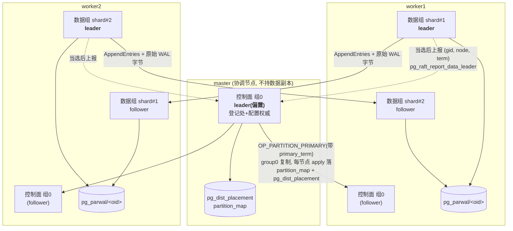

# ShardPG+ Raft 模块修订计划

## 1. 计划定位

本计划用于替代旧的“pgraft spike + 控制面 MVP”路线，作为 `CyanPandas/ShardPG` 分支
`shardpg-3.0`（raft4 四节点临时环境）的对照文档。文中凡出现 `/home/pxr/pg-citus-cluster`
路径或“3 节点”拓扑之处，均为 2026-07-12 之前的历史环境描述，**一律以 shardpg-3.0 的
四节点环境为准**（master:5432 + worker1-3:5433-5435，多数派 3/4）。

当前主线不再恢复 pgElephant/pgraft Go bridge，而是继续推进项目内已有的纯 C `pg_raft`。

**定位已于 2026-07-17 修订（§11）**：早期版本写的是“Raft 只做控制面共识、切主决议，不另起
数据面复制框架”。自 P1/P2 落地后不再成立 —— Raft 现在是**两层**：控制面（组 0）管拓扑与
决议，数据面**每分区一个 Raft 组**负责该分区 parwal 字节的复制与定序。这不是“重复造一套
数据面”，而是把 `pg_parwal/<partition>/` 里**已经存在**的每分区单调日志直接当作该组的
Raft log 来运输；物理回放（redo）是骑在其上的应用层，见 §11.1。

核心要求：主从切换不能只更新 `partition_map`。**该要求已于 2026-07-24 由 §13 的切主重构
兑现**：新 primary 由分区组内**多数派自治选举**产生（选举限制天然只让日志最全的副本当选），
经上报登记进 group 0（任期栅栏防迟到/重复），并落到路由层（每节点本地
`pg_dist_placement`）。旧的"控制面指定式切主"仅对 `primary_term = 0` 的历史分区保留。

## 2. 当前项目状态（2026-07-24，提交 `6cee2aa`）

### 2.1 架构前提（后续所有设计必须遵守）

集群由多个工作节点构成，数据被划分为若干逻辑分区（Partition）并在节点间分布式部署。
**每个工作节点同时承担多重职责：既是部分分区的主副本（Primary Replica），也是另一些分区的
从副本（Secondary Replica）。** 由此推出三条硬约束，贯穿全文：

1. **不存在全局“主节点”。** 数据面领导权是**按分区**的；只有控制面（组 0）有唯一 leader。
   任何“本节点是不是 leader”的判断都必须带上分区/组限定。
2. **一个节点会同时托管来自不同 leader 的多个分区副本。** 所有节点级共享资源（clog、xid
   空间、shmem 组表、BGW tick 预算）都会成为跨分区的争用点 —— §11.5.2 的阻断项全部源于此。
3. **对某个给定分区，一个节点要么是 primary 要么是 secondary，不会两者皆是。** secondary
   不会本地产出该分区的 WAL，因此该分区的 `partition_lsn` 编号空间在副本上只由 leader 指定
   （这是运输层加固第 1 条的依据，也是 raft_13 夹具曾经出错的原因，见 §11.5.1）。

### 2.2 已具备

- **控制面（组 0，职责=登记处+配置权威，见 §13）**：RequestVote（带
  `last_log_index/last_log_term` 日志新旧检查）、随机 election timeout（协调节点偏置窗口，
  leader 常态落 master）、心跳、AppendEntries（`nextIndex/matchIndex` + `prev_log` 一致性）、
  多数派 `commit_index`、HardState 落盘、更高 term 降级、TopologyMonitor（节点状态标注）。
- **切主（2026-07-24 重构，§13）**：数据组自治选举 → 新 leader 经
  `pg_raft_report_data_leader` 上报 group 0 leader → 任期栅栏（`partition_map.primary_term`）
  登记 → 每节点 apply 同步本地 `partition_map` 与真实 Citus 分片的 `pg_dist_placement`
  （落路由层）。安全性由选举限制（新 leader 必持全部已提交日志）+ 任期栅栏保证。
  旧"控制面指定式"通道（`switch_partition_lsn` 候选过滤那套）只对 `primary_term = 0`
  的历史/合成分区保留，随夹具迁移退役。
- **全局分片身份（P0）**：`partdist.shard_identity` 以 Citus `shardid` 为
  `global_shard_id`，可把一个组 id 解析为各节点各自的本地 OID，跨节点 `applied_part_lsn`
  比较自此才有意义。
- **分区级 Raft 组（P1）**：`RaftGroupTable` 每组一份共识/日志状态；组 0 = 控制面且行为与
  组化前逐字节一致；`raft_log` 按 `(group_id, log_index)` 分命名空间。
- **数据组复制（P2 + 运输层加固）**：真实 parwal 字节按 leader 指定的 `partition_lsn`
  复制到多数派、fsync 后才 ack、重传幂等、截断触达字节、`last_applied` 持久化。
- **`pg_partdist` 边界函数**（`src/raft_boundary.c`，7 个）：见 §5。
- **环满安全**：follower 环满时诚实拒绝（不再假 ack 造假多数派）；控制面 apply 游标
  滑出环窗口时按"元数据持久、跳过安全"语义窗口内快进（§13.4）。
- **事务 prepare 接线（§14）**：写入提交前自动逐条复制到分区组（[A] 后、[B] 前），
  多数派持久化才算 prepared，失多数派事务中止；顺带获得旧 primary 写栅栏。
- **并发下的 prepare 多数派保证（2026-08-03，DTX-2PC 第 1 步）**：修掉 group commit
  让路窗口——触达分区集合改为 `PartWALInsert` 时 per-backend 登记，`PartWALFlush`
  的**提前返回路径也调复制挂钩**；本组的复制在 pg_raft 侧串行化（认领位 +
  持有者消失时回收），消除并发 backend 抢同一段 plsn 的重复提案。
  回归 `raft_17`，含修复前必失败的对照实验。
- **跨分区事务 2PC（2026-08-04，DTX-2PC 第 2–5 步）**：记录格式（`PARTWAL_FLAG_DTX`）、
  决议层（`dtx_decide`/`dtx_status`，决议在协调组达多数派即为全局提交点）、
  **内核补丁 0004 的 `pre_record_commit_hook`**（把决议接进客户端提交路径）、
  参与者自治登记与恢复守护、快路径与只读参与者剔除。回归 `raft_19`–`raft_22`，
  含 `pg_raft.dtx_2pc_enabled=off` 的对照实验。
- 回归基线：`pg-raft-src/run-raft-tests.sh` **raft_01–22 全绿**；
  `pg-partdist-src/tests/test_shard_identity_p0.sh` **10/10**；
  全新库 `CREATE EXTENSION` 冒烟通过（raft_19 A 段，2026-08-04 正是它抓到
  master 侧 hook 在没装 Citus 的库里直接引用 `pg_dist_transaction` 的缺陷）。

### 2.3 当前缺口

- **物理回放（P3）未开始**：apply 仍是“平凡 apply”，只推进
  `follower_partition_map.applied_part_lsn`，不做 `rm_redo`，follower 堆表不含数据。
  **由此，切主后的路由切换是"机制先行"**——新主壳表没有历史数据，生产语义要等回放
  追平后才能放行切换（§13.6 #1）。
- **xid/clog 跨 leader 冲突未解**（§11.5.2 #1，最硬的阻断项）。
- `RAFT_MAX_GROUPS = 32`，与“每节点托管几十上百分区”冲突；日志仍在定长 ring
  （`RAFT_LOG_CAPACITY = 128`，落后超容量时靠拒写背压），未外部化到 parwal，无日志压缩。
- ~~**组成员集不随 RPC 传播**：自动建组的 follower 成员集为空，按全体 peers 算多数派；~~
  **→ 2026-08-03 已修**（`DTX_2PC_DESIGN.md` §9.2，回归 raft_18）：数据组的空成员集
  语义由"全体节点"改为"**未知**"，未知的节点不竞选/不当选/不提案（**被动应答
  仍照旧**——否则 §11.5.2 约定的 hearsay 引导路径会被砍掉，全新分片永远选不出
  leader，初版一刀切时 raft_14/15/16/17 全挂）；权威成员集改为从控制面下发的
  `partdist.partition_map` 本地导出。
  残留：全新分片首次选举（登记尚不存在）仍须显式给成员集；成员**变更**仍缺
  joint consensus。原文后半句仍成立：
  上报路径在成员集未知时退化为"全体 peers 去掉自己与协调节点"（§13.6 #2）。
- `raft_snapshot` 仍只是控制面元数据快照表，**没有 Raft InstallSnapshot RPC**。
- `partwal_notify_primary_switch()` 仍是日志占位，未做真实角色切换。
- ~~`pg_raft_data_propose()` 未接入写入路径~~ **→ 2026-07-24 已接入事务 prepare 路径**
  （§14，PartWALFlush 挂钩自动逐条 propose）。仍缺**后台追平通道** —— 无写入流量时
  落后 follower 不自行收敛（下一次写入的挂钩会顺带补齐增量）。
- ~~2PC 的 commit 决议尚未实现。~~ **→ 2026-08-04 端到端落地**：
  设计定稿于 `pg-partdist-src/docs/DTX_2PC_DESIGN.md`（DTX-2PC v1），
  **决议放数据组，不走控制面**（理由见该文 §3.2）。该文 §10 的第 0–5 步全部完成、
  回归 raft_17–22：让路窗口修复 → 成员集显式化 → 记录格式 → 决议层 →
  **内核补丁 0004（`pre_record_commit_hook`）把决议接进客户端提交路径** →
  参与者恢复守护 + 快路径 + 只读参与者剔除。
  **跨分区事务现在真的走 2PC，提交点是决议记录在协调组达多数派持久化的那一刻。**
  剩该文第 6 步（升主 in-doubt 清理、快路径分叉归队规则），需与惰性回放的
  promotion 路径合流。

## 3. 目标架构

master 是协调节点（Citus coordinator）：持权威元数据、group 0 leader 优先落于此、
**不作任何分区的数据副本**。每个 worker 内部同时跑着**控制面组的一个成员**和**若干
数据面组**，其中一部分数据组它是 leader（该分区的 primary），另一部分它是 follower
（该分区的 secondary）：



注意图中 worker1 对 shard#1 是 leader、对 shard#2 是 follower，worker2 恰好相反 ——
这正是 §2.1 的架构前提，**数据面没有全局主节点**；master 只是控制面/路由的协调点。

分层原则（2026-07-24 起的职责边界，§13.1）：

- **控制面 Raft（组 0，成员=全部 4 节点，leader 偏置 master）**：**登记处 + 配置权威**——
  接收数据组 leader 的当选上报、任期栅栏裁决、经 raft 日志把结果同步到每个节点
  （含路由层 `pg_dist_placement`）；节点状态、组配置/成员集（待下发机制）、快照；
  后续的 xid 区间租约、2PC 恢复等全局服务。**控制面不决定数据面谁当 leader，
  也不按分区拆分。**
- **数据面 Raft（每分区一组，成员=该分片副本所在 worker，绝不含 master）**：自治选举
  （leader 即该分区 primary）、该分区 parwal 记录的复制与定序、当选后主动上报。
  日志内容是 `pg_parwal/<partition>/` 中已存在的每分区单调记录，Raft 只负责运输、
  定序和多数派持久化，**不重新设计一套记录格式**。
- **运输层 vs 应用层**：数据组给出的是“这条记录已在多数派 fsync 落盘且定序”；把字节变成
  堆表内容的 redo 是骑在其上的应用层（P3），二者解耦验证，见 §11.1。
- **切主安全线**：对有数据组的分区，由 Raft 选举限制内生保证（新 leader 必持全部已提交
  条目）+ `primary_term` 任期栅栏（迟到/重复登记拦下）；旧的
  `switch_partition_lsn`/`applied_part_lsn` 候选过滤仅服务 `primary_term = 0` 的遗留分区。
- **一致性边界**：登记结果写 `partition_map` 与本地 `pg_dist_placement`（每节点一份，
  由 group 0 的 apply 完成，不是全节点强同步——多数派提交+全员 apply，宕机者重放追平）；
  成员集必须由控制面下发，不能从收到的报文里推断（当前缺口，§11.5.2 #3）。

## 4. 阶段目标

> **阶段完成度速览（2026-07-24）**：阶段 0 ✅ / 阶段 1 ⚠️ 大部完成（缺 InstallSnapshot
> 与日志压缩；环满假 ack 已修）/ 阶段 2 ✅ 且其"控制面指定式切主"已被 §13 的
> "自治选举+上报登记"取代（切主通知仍为占位）/ 阶段 3 ⚠️ 运输部分完成并经 raft_14 按
> 真实分片验收、redo 与 2PC 未做 / 阶段 4 ⚠️ P0+P1+P2+切主重构完成、P3 未启动。

### 阶段 0：归档旧路线并清理文档 ✅ 已完成

目标：把 pgraft Go bridge 从当前实施路径中移除，仅保留为历史调研资料。

工作项：

- 清理旧 pgraft spike 文档、脚本和容器挂载入口，不再保留为当前仓库的运行入口。
- 从主文档中删除或弱化 `pgraft_is_leader()`、`pgraft_kv_put/get`、Go runtime、`shared_preload_libraries='pgraft'` 作为实施步骤的描述。
- 保留并更新 `README-RAFT.md`、`setup-raft.sh`、`run-tests.sh`、`docs/interfaces/partwalmgr_raft.idl`。
- 不删除 PostgreSQL 数据目录、构建产物和 `pg-cluster-data` 运行状态文件，除非后续单独执行工作区清理。

验收标准：

- README 明确写明当前主线是纯 C `pg_raft`。
- 旧 pgraft 资料不再作为仓库入口；需要历史记录时从 Git 历史查看。
- 过时 demo、组会展示、raft10 或备份脚本不再作为推荐入口。

### 阶段 1：补齐纯 C Raft 安全语义 ⚠️ 大部完成

目标：将当前 `raft_consensus.c` 从 demo 级共识推进到“最小安全 Raft 子集”。

工作项：

- ✅ 扩展 RequestVote RPC：`term, candidate_id, last_log_index, last_log_term`。
- ✅ 加入投票前的日志新旧检查，只有日志至少一样新的候选人才授票。
- ✅ 持久化 HardState：`current_term`、`voted_for`、`commit_index` 必须先落盘，再响应
  RequestVote 或 AppendEntries。（2026-07-20 升级为文件 v2，增加 `last_applied`，兼容读 v1。）
- ✅ 完善 follower catch-up：落后 follower 恢复后通过 `nextIndex/matchIndex` 追赶。
- ❌ **增加 snapshot install 设计**：`raft_snapshot` 至今仍只是控制面元数据快照表，
  **没有 InstallSnapshot RPC**。日志落后超 ring 容量时目前靠“拒绝新条目”背压，
  而不是安装快照。
- ✅ 完善 leader 宕机重选：新 leader 必须拥有所有已提交日志，旧 leader 恢复后必须降级为
  follower（raft_08 / raft_11）。
- ❌ **替换固定 ring buffer 的长期假设，补上日志截断/压缩策略**：仍是
  `RAFT_LOG_CAPACITY = 128` 定长 ring。多组之后这一项从“长期优化”变成阻断项，
  正解见 §11.5.2 #2（数据组日志外部化到 parwal）。

验收标准：

- 多数派不可用时 propose 不提交。
- 日志落后的节点无法赢得选举。
- 旧 leader 恢复后不会覆盖新 leader 已提交状态。
- follower 掉线恢复后能通过日志或快照追平。

### 阶段 2：控制面 failover 正确性与新版 PartWAL 进度对接 ✅ 已完成（已被 §13 取代为遗留通道）

目标（当时）：把分区 primary 切换从“改元数据”升级为“Raft 决议 + 新版 PartWAL 进度证明 + 切主通知”。

> **2026-07-24 起本阶段的"控制面指定式切主"降级为遗留通道**：数据组落地后，有组的分区
> （`primary_term > 0`）切主完全由组内自治选举 + 上报登记完成（§13），下述流程只对
> `primary_term = 0` 的历史/合成分区生效，随夹具迁移退役。历史落地情况：流程 1–6 全部
> 完成（回归 raft_02 / raft_07 / raft_10）。**第 7 步“follower replay 随新 primary 完成
> 角色和进度刷新”未完成** —— `applied_part_lsn` 自 P2 起已是真值（由数据组 apply 推进），
> 但 `partwal_notify_primary_switch()` 至今仍只写日志，不做真实角色切换；
> 真正的角色切换依赖 P3 物理回放落地。

`OP_PARTITION_PRIMARY` payload（2026-07-24 增加 `primary_term` 任期栅栏字段）：

```json
{
  "partition_id": 9102,
  "old_primary_node": 3,
  "primary_node": 1,
  "secondary_nodes": [2],
  "primary_term": 8,
  "switch_partition_lsn": 123,
  "switch_orig_lsn": "0/16B6A20"
}
```

切主流程：

1. TopologyMonitor 检测到 primary 故障后，生成一次 failover 提议。
2. 当前 leader 从新版 PartWAL 进度接口读取候选副本的 `applied_part_lsn` 或等价 ACK 进度。
3. 只有已经追平到 `switch_partition_lsn` 的副本才允许成为新的 primary；若没有进度来源，则拒绝自动提升并记录告警。
4. leader 提交 `OP_PARTITION_PRIMARY`。
5. apply 阶段更新 `partition_map`，并刷新 `pg_partdist` 缓存。
6. apply 完成后调用新版切主通知接口；若上游尚未提供，则保留并实现 `partwal_notify_primary_switch(partition_id, old_primary, new_primary, switch_orig_lsn)` 作为 Raft 与 PartWAL 的边界。
7. follower replay / `follower_partition_map` 随新 primary 完成角色和进度刷新。

验收标准：

- 只切换受故障 primary 影响的分区。
- 未追平 `switch_partition_lsn` 的 secondary 永远不能被提升。
- 切主前后 `partition_lsn` 保持单调。
- 旧 primary 恢复后只能以 secondary 身份回归。

### 阶段 3：接入 shardpg-2.0 数据面同步与 2PC 决议 ✅ 2026-08-04 完成（redo 回放另计）

目标：基于 `shardpg-2.0` 已有 PartWAL 同步写入和 follower replay 设计，实现方案文档要求的真正多副本同步，而不是在 Raft 模块里重新设计一套数据面。

> 落地情况：**跨节点日志传输已由分区级 Raft 组实现**（P2 + 运输层加固，§11.5/§11.5.1）——
> 原计划设想的 WalSender/WalReceiver 流式通道**不再需要**，AppendEntries 本身就是那条通道，
> 且天然带多数派语义。
> **2PC 决议已于 2026-08-04 端到端落地**（`DTX_2PC_DESIGN.md` §10 第 0–5 步，
> 回归 raft_17–22）：决议不进控制面，写在写集内按 `hash(dtxid)` 选出的分区组日志里，
> 该记录达多数派持久化即为全局提交点；内核补丁 0004 的 `pre_record_commit_hook`
> 把它接进了客户端提交路径。仍未完成的是 **redo 回放（P3）**，以及升主时的
> in-doubt 清理（该文 §9.6，与惰性回放的 promotion 路径合流时再做）。

PartWAL 接入链路：

- ✅ Primary 写入本地 `pg_wal`，`wal_insert_hook` 通过 `PartWALInsert` 捕获分区相关 WAL 记录。
- ✅ `XACT_EVENT_PRE_COMMIT` / `XACT_EVENT_PRE_PREPARE` 调用 `PartWALFlush`，保证 `pg_parwal` fsync 早于事务提交 WAL fsync。
- ✅ **跨节点传输**：该分区的 Raft 组 leader 读出记录，随 AppendEntries 下发给成员；
  follower 先按 leader 指定的 `partition_lsn` 落盘并 fsync，再 ack。
- ❌ **follower 侧回放**：按 `FOLLOWER_REPLAY_DESIGN.md` 做 redo 尚未开始（P3）；
  当前只推进 `follower_partition_map.applied_part_lsn`，不改堆表。
- ✅ Raft 控制面读取 follower 进度，作为切主候选筛选的依据（进度自 P2 起为真值）。
- ❌ **无后台追平通道**：数据条目只在 client backend 的 propose 路径下发，
  且 `pg_raft_data_propose()` 尚未接入 demux/写入路径，目前仅回归在调用。

事务语义 —— **prepare 阶段的权威设计（2026-07-24 用户定稿）**：

事务的 prepare 阶段，对事务涉及的每个分片组 Si **并行**执行：

1. Si 的 Leader 把该分片的数据修改记录（DATA Record，即 heap WAL 内容）写入
   `pg_parwal/Si/` 段文件并分配 `partition_lsn`。此时的 DATA Record 只含数据变更、
   不含提交标记，处于**预备态**。
   → 机制已具备：`wal_insert_hook` 捕获 + PRE_COMMIT 落盘 fsync（`[A]<[B]` 不变式）；
   parwal 天然只收该分区的 heap 记录，commit record 属 XACT rmgr 不入 parwal，
   "不含提交标记"自动成立。
2. Leader 将该 DATA Record 作为 Raft Log Entry 发送给 Si 的所有 Followers。
   → ✅ **已自动挂接（2026-07-24 当日完成，见 §14）**：PartWALFlush 在 [A] 之后、
   [B] 之前经 rendezvous 挂钩对本事务涉及的每个分区逐条 propose；
   凑不齐多数派即 ERROR，事务在 prepare 中止。验收 raft_16。
3. Leader 和 Followers 收到日志后均写入本地 `pg_parwal` 并执行 fsync。
   → 已具备并验收：follower **先 fsync 再 ack**（P2 + 运输层加固），
   leader 侧 PRE_COMMIT fsync。
4. 该日志在 Si 达到 Raft 多数派持久化后，进入 prepared 状态。
   → 多数派语义已具备并验收：多数派提交 == 多数派已持久化（raft_13 反例：失多数派
   propose 必须失败）。**"prepared 状态"作为事务状态机本体已于 2026-08-04 落地**：
   参与者侧就是 PG 原生的 prepared transaction，配一条 `DTX_PREPARE` 标记记录
   （携带 dtxid ↔ 本地 top-level xid 的绑定）+ `partdist.dtx_participant` 登记，
   状态机的推进由协调组的决议驱动（`DTX_2PC_DESIGN.md` §6.1，回归 raft_22 C）。

其余（2PC 决议）——**2026-08-03 定稿，下述控制面方案已作废**：

> ~~Commit WAL 和协调者最终决议必须在**控制面** Raft 复制到多数派后才能成功返回；
> 控制面 Raft 新增 `OP_PREPARE_DECISION` 和 `OP_COMMIT_DECISION`。~~
>
> **被 `pg-partdist-src/docs/DTX_2PC_DESIGN.md` 取代。** 决议不进控制面，而是写在
> **本事务写集内按 `hash(dtxid)` 选出的那个分区组**的日志里，该记录达多数派即为
> 全局提交点。三条理由（该文 §3.2）：(1) 控制面 leader 常态在 master，每个跨分区
> 事务都压一次多数派写会让单点更单点；(2) group 0 成员是全部 9 节点、数据组成员是
> 3 副本子集，两个多数派互不蕴含，恢复要做跨组交叉判定；(3) §13 的自治选举+上报
> 已让"某组现任 leader 是谁"成为随时可查的元数据，放数据组不引入新的服务发现问题。
> 形态与 Spanner（commit record 写 coordinator Paxos group）、TiKV（decision 写
> primary region）一致。

- 决议记录、PREPARE/COMMIT 标记的字节格式见该文 §5；协调组选取见 §4；
  协调者宕机走 **presumed abort**（查无决议即中止）而非"新 leader 续跑"，见 §2.2。
- 接口继续与 `GlobalXID`、TSO、增强 CLOG 保持对齐（TSO 未建时 `commit_ts` 先用
  协调者本地时钟，决议原子性不依赖它，见该文 §9.8）。

验收标准：

- prepare / commit 未达到 quorum ACK 前，客户端不能收到成功。
- primary 故障后，新 primary 能恢复 prepared / committed 决议。
- 跨分区事务不会出现部分提交。

### 阶段 4：长期演进为每分区独立 Raft group

目标：将每个 partition replica set 演进为独立 Raft group。

> 具体工程分期、共享内存/日志存储模型、调度器、全局分片身份与"运输定序层 vs
> 回放应用层"的定位,见 §11《分区级 Raft 组落地方案(2026-07-17)》。本节仅保留方向性描述。

设计方向：

- 每个 partition 独占一个 Raft group，成员为该分区的 primary + secondaries。
- partition primary 就是该 partition 的 Raft leader。
- 数据日志可以直接作为 Raft log entry，或以 Raft 有序方式绑定 PartWAL record 提交。
- 控制面 Raft 继续负责拓扑、成员变更和故障感知，数据面 Raft 负责该分区日志提交。

验收标准：

- 单个分区的 leader 切换不影响其他分区。
- 写入只在该分区多数派提交后成功。
- 成员变更通过 joint consensus 或等价安全机制完成。

## 5. 接口规划

### Raft RPC

- ✅ `RequestVote(group_id, term, candidate_id, last_log_index, last_log_term)`
- ✅ `AppendEntries(group_id, term, leader_id, prev_log_index, prev_log_term, leader_commit, entries[])`
  —— 数据组条目额外随行一个 `bytea` 原始 WAL 字节参数。
- ❌ `InstallSnapshot(...)` **未实现**。
- ⚠️ 报文里的 `group_id` 缺省 0（向后兼容），但**成员集不在报文里传播**，是当前缺口。

### 控制面日志操作

- ✅ `OP_NODE_STATUS`
- ✅ `OP_PARTITION_PRIMARY`（2026-07-24 起 payload 含 `primary_term`；apply 带任期栅栏，
  真实 Citus 分片同步更新本地 `pg_dist_placement`——单放置守卫 + 子事务隔离）
- 🚫 ~~`OP_PREPARE_DECISION`~~ / ~~`OP_COMMIT_DECISION`~~ **已废弃，不会实现**：
  2PC 决议改由数据组承载，控制面不参与（见 `DTX_2PC_DESIGN.md` §3.2）。
  新增的是**数据组内**的记录类型（`PARTWAL_FLAG_DTX` + `DtxRecordPayload`，
  该文 §5）与两个 SQL 入口 `partdist.dtx_decide` / `partdist.dtx_status`（§6.3）。
  **→ 2026-08-03 已落地并经 raft_20 验收**（决议记录在协调组达多数派持久化即为
  全局提交点）。**→ 2026-08-04 接进客户端提交路径**：内核补丁 0004
  （`pre_record_commit_hook`，在 `CommitTransaction()` 里、全部
  `XACT_EVENT_PRE_COMMIT` 回调之后、`RecordTransactionCommit()` 之前）+
  参与者自治登记 `partdist.dtx_participant` + master 侧写集收集/协调组选取/决议，
  经 raft_22 端到端验收。**跨分区事务现在真的走 2PC。**
- ⚠️ `OP_CONFIG_CHANGE`（成员**变更**仍依赖它）。**成员集下发已不依赖它**：
  2026-08-03 起数据组成员集从控制面已下发的 `partdist.partition_map` 本地导出
  （`DTX_2PC_DESIGN.md` §9.2），无需新增 RPC。
- ✅ 数据组内部条目类型：`OP_PARWAL`（描述符 + 随行字节；数据字节的门控按 `op_type` 判定，
  **不能**按 `group_id > 0` 判定，否则数据组里的普通条目复制不出去）

### 切主重构新增接口（2026-07-24，§13）

- ✅ `pg_raft_report_data_leader(p_group_id BIGINT, p_leader_node INT, p_term BIGINT,
  p_secondary_nodes INT[]) → BIGINT`：数据组新任 leader 的登记入口，须在 group 0 leader
  上执行；返回 >0=已提名 / -1=无需登记 / 0=非 group 0 leader（上报方据此重试或停止）。
- ✅ GUC `pg_raft.coordinator_node_id`（缺省 1）：协调节点 —— group 0 选举偏置窗口
  [2b/3, b)、数据组成员集/登记双重排除。
- ✅ `partdist.partition_map.primary_term` 列：任期栅栏；0 = 尚无数据组接管
  （遗留通道的生效条件）。

### PartWAL 对接接口（`pg-partdist-src/src/raft_boundary.c`，schema `partdist`）

**调用约定**：所有函数都收**本节点的** `partition_id`（= 分片表本地 OID = `pg_parwal/` 目录名）。
各节点 OID 不同，调用方必须先用 P0 的 `local_partition_for_shard(global_shard_id)` 把组 id
解析成本节点的 OID —— 这是“一节点多角色”架构下最容易出错的一步。

进度与切主（阶段 2 落地）：

| 函数 | 语义 | 状态 |
|------|------|------|
| `get_partition_flush_lsn(OID) → BIGINT` | 本节点该分区最新已持久化 `partition_lsn` | ✅ |
| `get_follower_applied_part_lsn(OID) → BIGINT` | 本节点该分区 follower 的 `applied_part_lsn` | ✅ |
| `partwal_notify_primary_switch(OID, INT, INT, PG_LSN) → void` | `OP_PARTITION_PRIMARY` apply 成功后调用 | ⚠️ 仍是日志占位 |

数据组复制（P2 + 运输层加固落地）：

| 函数 | 语义 | 状态 |
|------|------|------|
| `partwal_read_record(OID, BIGINT) → (orig_lsn, rmid, info, xid, data)` | leader 按 `partition_lsn` 读出整条记录 | ✅ |
| `partwal_follower_append(OID, BIGINT, PG_LSN, INT, INT, BIGINT, BYTEA) → BIGINT` | follower **按 leader 指定的 `partition_lsn`** 落盘 + fsync；重传幂等 no-op，空洞 ERROR | ✅ |
| `partwal_truncate_to(OID, BIGINT) → BOOLEAN` | Raft 日志截断时同步截断 parwal 字节 | ✅ |
| `follower_set_applied_part_lsn(OID, BIGINT) → BOOLEAN` | 单调推进进度游标 | ✅ |

全局分片身份（P0 落地）：`shard_global_id(OID)` / `rebuild_shard_identity()` /
`register_shard_identity(OID)` / `local_partition_for_shard(BIGINT)` / `global_id_for_partition(OID)`。

> **维护约束**：`partwal_follower_append` 的签名在运输层加固中变过一次（新增第 2 个参数
> `p_partition_lsn`）。改签名时必须同步改 `COMMENT ON FUNCTION` 的参数列表、`setup-raft.sh`
> 的 `ensure_boundary_functions` 与其 cleanup 段，以及 `pg-install/share/postgresql/extension/`
> 下的已安装副本。**已装扩展不会重跑安装脚本**，所以这类不一致在回归里是静默的——
> 只有在全新库上 `CREATE EXTENSION` 才会暴露。（2026-07-21 即因此修了一次遗漏的 COMMENT。）

## 6. 测试计划

现有基线：**`pg-raft-src/run-raft-tests.sh` 共 32 项断言全绿（raft_01–16）**，
外加 `pg-partdist-src/tests/test_shard_identity_p0.sh` 10/10 与全新库
`CREATE EXTENSION pg_partdist` + `pg_raft` 冒烟。
（入口已从旧的 `run-tests.sh` 改为 `run-raft-tests.sh`；该脚本**必须在宿主机上跑**，
它内部自己调 `docker`，但 `-f` 引用的测试 SQL 路径是容器内路径——新增测试文件要
`docker cp` 进容器。）

| 用例 | 覆盖场景 | 状态 |
|------|------|------|
| `raft_01_leader_election` | 选举收敛，唯一 leader | ✅ |
| `raft_02_failover_partition` | primary 故障只切受影响分区 | ✅ |
| `raft_03_split_brain_guard` | 脑裂防护 | ✅ |
| `raft_04_topology_monitor` | 拓扑感知与自动 failover | ✅ |
| `raft_05_no_majority_reject_commit` | 少于多数派拒绝提交，无脏 apply | ✅ |
| `raft_06_stale_requestvote_rejected` | 日志落后候选人竞选失败 | ✅ |
| `raft_07_uncaught_up_secondary_not_promoted` | 未追平副本不得晋升 | ✅ |
| `raft_08_old_leader_rejoins_as_follower` | 旧 leader 恢复后降级 | ✅ |
| `raft_09_hardstate_crash_recovery` | 崩溃重启 term 不回退、已提交日志不丢 | ✅ |
| `raft_10_most_caught_up_secondary_promoted` | 最追平副本被提升，切换点=真实 flush 进度 | ✅ |
| `raft_11_old_leader_log_catchup` | 旧 leader 回归后追平已提交决议 | ✅ |
| `raft_12_multi_group_isolation` | 多组独立选举、日志按组隔离 | ✅ |
| ↳ raft_12 夹具于 2026-08-03 随 §9.2 调整 | 两处旧写法依赖的正是被修掉的不安全行为：① 以**空成员集**建组（现已报错拒绝）⇒ 改为显式 `ARRAY[2,3,4]`；② 在**控制面 leader（常态是 master）**上断言"两个数据组均可见"——master 永不作数据副本，旧写法能过只因空成员集会让组经 hearsay 撒到全集群 ⇒ 改到数据组成员节点上断言。顺带修掉"非 leader 提交被拒"挑到组外节点的问题（那里组根本不存在，propose 同样返回 0，是"对的结果、错的原因"） | — |
| `raft_13_data_group_replication` | 数据组多数派提交、字节级一致、失多数派拒写（reference 夹具，保留作运输层回归） | ✅ |
| `raft_14_hash_shard_secondary_backup` | **真实哈希分片 (a) 形态**：多记录逐条 propose、follower 逐字节指纹一致、`partition_lsn` 1..N 连续无洞、一条 record 一次备份、不回放（壳表 0 行）、初次登记（primary/term/secondaries 不含 master）、路由层一致、master 无分片身份 | ✅ |
| `raft_15_self_election_failover` | **切主全链路**：停主 → 组内自治选举 → 上报登记 → 每节点 `partition_map`+`pg_dist_placement` 落新主（任期递增、master 不入 secondaries）→ 旧主重启以 follower 归队、登记不回退 | ✅ |
| `raft_16_prepare_auto_replicate` | **prepare 接线（§14，全程无手工 propose）**：仅 INSERT 即自动逐条复制、逐字节一致；失多数派 INSERT 必败（prepare 中止）行数不变；恢复后自动追平。**两处终态判据于 2026-08-04 改为有界重试（30s 窗口）**：2PC 接线后一笔事务要跑三轮复制（DATA／PREPARE 标记／COMMIT 标记），各自凑各自的多数派，同一个 follower 可能连续两轮都不在多数派里而短暂落后，靠 leader 下一次心跳补齐——终态一致但到达得比固定 `sleep 2` 晚。这是"缺后台追平通道"（§12.4）的既有边界被放大，不是新缺陷（`DTX_2PC_DESIGN.md` §9.7.1） | ✅ |
| `raft_17_concurrent_prepare_quorum` | **并发 prepare 的多数派保证（§14.3 #1 的让路窗口）**，用例本体在 `test/raft_17_concurrent_prepare_quorum.sh`（可独立跑），三阶段：① 同 worker 两数据组 + 8 会话并发单行 INSERT，断言持有完整前缀的成员数 >= 多数派（不是"全体追平"——Raft 只保证 quorum，且尚无后台追平通道）；② **确定性让路**：长事务 P 写 B 组后 pg_sleep，并发短事务 Q 的 flush 顺带消费其槽位并推过 flushed_upto，P 提交必走提前返回分支——断言被让路的 P 的记录仍达多数派；③ 失多数派 + 并发写，断言提交成功行数 == 0（2PC prepare 性质回归）。两个 burst 阶段均先甄别节点崩溃再断言。**真对照实验**（同用例仅换 .so、nm 验证构建身份）：让路窗口未修的构建在阶段二确定性失败（P 提交成功而记录只在 leader：43 vs 41/41），修复版 43/43/43 | ✅ |
| `raft_18_membership_explicit` | **成员集显式化与真实多数派（§11.5.2 #3）**，用例本体在 `test/raft_18_membership_explicit.sh`（可独立跑），四条确定性判据：A 成员集未知（NULL 且 partition_map 无登记）时**建组必须报错拒绝**且不留残组；B 有控制面登记时 NULL 建组**自动导出**成员集，`cluster_size=3` 而非 9；C **quorum 按真实成员数**——3 成员全在可写、停 1 个（2/3）仍可写、停 2 个（1/3）必败；D 非副本节点不被 hearsay 拖入该组。真对照（nm 验证构建身份）：修复前 A 处 `group_create` 返回 `t`，建出 `cluster_size=9` 的组、向全集群广播选举、真正的数据持有者反被挤成 follower。**注意 C 不断言"某个特定节点当选"**——Raft 不保证哪个成员赢，用例动态发现 leader 与待停 follower（初版硬断言 worker1 当选，实测 worker3 先超时先当选而误报） | ✅ |
| `raft_19_dtx_record_format` | **DTX-2PC 记录格式与 flags 端到端保真（`DTX_2PC_DESIGN.md` §5）**，用例本体在 `test/raft_19_dtx_record_format.sh`（可独立跑），四段：A **全新库 `CREATE EXTENSION` 冒烟 + 四个函数签名**（这是唯一能抓到签名不一致的检查，本次实施踩到两次）；B leader 侧 DATA `flags=1`、DTX `flags=8`/`orig_lsn=0`/`info` 载子类型、DECISION 载荷（dtxid/coord/ts/verdict/participants[]）完整往返；C 对 DATA 记录调 `partwal_read_dtx_record` 返回 NULL（分类以 flags 判定）；D **follower 侧 flags/info 序列与 leader 完全一致** | ✅ |
| `raft_20_dtx_decision` | **DTX-2PC 决议层（`DTX_2PC_DESIGN.md` §6）**，用例本体在 `test/raft_20_dtx_decision.sh`（可独立跑），五段：A 非协调组 leader 调 `dtx_decide` 返回 NULL 且不留痕；B **COMMIT 决议返回后 DECISION 记录与索引表在协调组全部成员上均在**——返回即"已在多数派持久化"，这就是全局提交点；C 决议槽一次性（对同一 dtxid 再决议 ABORT 仍返回 1）；D **推定中止**：查无决议时 `dtx_status` 先写 ABORT 达多数派再答 2，此后 COMMIT 无法翻盘；E **协调组切主后两笔决议仍可查**——索引表由各成员 apply 时各自维护，协调权随 Raft 选举自动转移，无需状态搬迁 | ✅ |
| `raft_21_dtx_recovery` | **DTX-2PC 参与者侧恢复守护（`DTX_2PC_DESIGN.md` §7）**，用例本体在 `test/raft_21_dtx_recovery.sh`（可独立跑），四段：A 协调组已有 COMMIT 决议 ⇒ 恢复守护提交 prepared 事务、数据可见、补 `DTX_COMMIT` 标记；B 从未决议 ⇒ 经 `dtx_status` **推定中止**、回滚、补 `DTX_ABORT` 标记且**决议已落库**（推定中止是写下来的，不是隐含的）；C 未超时的 prepared 事务不被触碰（不与正常路径抢答）；D **协调组不可达 ⇒ 保持 prepared 不动**——绝不擅自决定。夹具用手工 `PREPARE TRANSACTION 'shardpg_dtx_<dtxid>_<coord_gsid>'` 造 in-doubt 事务，测的是守护本身，与谁产生 prepared 事务无关 | ✅ |
| `raft_22_dtx_end_to_end` | **DTX-2PC 端到端（`DTX_2PC_DESIGN.md` §3.3/§3.4/§5.3/§8.3/§9.3）**，用例本体在 `test/raft_22_dtx_end_to_end.sh`（可独立跑），六段：A 前置——二进制导出 `pre_record_commit_hook` 且逐节点 `citus.recover_2pc_interval=-1`；B **真实跨分区事务**提交后协调组有且仅有一条 COMMIT 决议、participants 恰为真实写集、协调组 == `participants_sorted[dtxid % n]`、**且决议在协调组每个成员上都在**；C 三阶段在 parwal 流里逐条可见（参与组 `DATA…,PREPARE,COMMIT` ／协调组 `DATA…,PREPARE,DECISION` 且**无**单独 COMMIT 标记），PREPARE 携带本地 top-level xid 且排在 DATA 之后；D **快路径**：单分区事务不写决议也不写标记；E **只读参与者剔除**：广播 UPDATE 打到全部 8 个分片但只有 1 个真改到行 ⇒ 不产生决议，同时只读参与者仍留 `gsids='{}'` 的登记（它崩溃后自解的唯一线索）；F **协调组失去多数派** ⇒ 事务**提交失败**且无行可见（不允许部分提交）。**判据构造有坑**：只停协调组 leader 不行——组内还剩 2/3 会自治选出新 leader 并上报改写路由，决议照样做得出来、事务本就该成功（那正是"协调权随选举转移"在起作用），必须停两个成员。**真对照**：`pg_raft.dtx_2pc_enabled=off` 重跑，B 段确定性失败 | ✅ |

> **run-raft-tests.sh 已于 2026-08-03 改为拓扑自适应**：按容器 `pg-cluster-data/`
> 下的实际目录探测协调节点目录名（raft4 是 `master`，pg_citus_raft 是
> `coordinator`）与 worker 数，节点 id ↔ 端口按 `BASE_PORT + N - 1` 算术推导。
> 因此同一套用例可在 4 节点（raft4）与 9 节点（pg_citus_raft）环境跑。
> 可用 `CONTAINER` / `COORD_DIR` / `N_WORKERS` / `BASE_PORT` 覆盖。
> quorum 编排本身与节点数无关（raft_05 停"除 leader 外全部节点"；数据组用例用
> 显式 3 成员组），所以只需要改映射函数。

> **⚠️ 套件不是幂等的，连跑多轮会积累状态（2026-08-04 实测）**：每轮都会新建
> Citus 分片、建/弃数据组、并因 leader 上报改写 `pg_dist_placement`；被 DROP 的
> 分片表留下的 `pg_parwal/<oid>/` 目录不会回收（实测单节点 170+ 个）。连跑到第
> 六轮时出现一批**与本次改动无关**的失败：控制面上报链路超时、`pg_dist_placement`
> 与数据组 leader 分叉导致"本节点不是该分区组的 leader"、raft_17 的长事务夹具
> 建不起来。就地重建 `pg-cluster-data`（initdb + Citus 接线 + setup-raft）之后
> 同一份代码全绿。
>
> **判据**：排查回归失败前先看它是不是只在"连跑很多轮之后"出现——是的话先重建
> 环境再复现，否则很容易把环境噪声误读成代码缺陷（本轮差点误判两次）。
> 重建脚本参照 `reproduce-env.sh` 的 `[4/6]`–`[6/6]` 三段；`reproduce-env.sh up`
> 本身会**重新克隆并覆盖工作区**，有未提交改动时不能直接用。

> **✅ 并发写入路径三缺陷已定位并修复（2026-08-03，详见 `DTX_2PC_DESIGN.md` §9.0）**
> 首次并发压 prepare 路径连环暴露、当日全部修复：
> ① `ReadRawWALRecordAt` 的 static reader 在事务上下文里懒分配 → 跨事务 UAF
> （gdb 前无 raft 组也 3/3 必崩的 segfault 主犯；修复=分配与整个读取过程切
> TopMemoryContext）；② `data_propose_one` 对 `partwal_read_record` 的
> 全 NULL 行不判 `isnull` 直接 `TextDatumGetCString` → 空指针解引用
> （gdb backtrace 实锤，si_addr=0x0；失多数派回滚后读被截断的 plsn 触发）；
> ③ **leader 侧失败回滚截断并发事务已落盘的字节** → 受害事务的挂钩空转、
> 带着"已复制"假象提交（丢数据，raft_17 阶段二抓获 13/240）——修复=leader 失败
> 只回滚 Raft 日志条目、字节留作孤儿重新 propose；follower 冲突截断保留。
> 方法论教训已固化进 raft_17：**并发验收必须先甄别 burst 期间是否有节点崩溃**
> ——崩溃重置 shmem 组表后 INSERT 会跳过挂钩提交成功，症状与让路窗口无法区分。

> **raft_15/raft_10 在 9 节点环境下的偶发失败已修（2026-08-03，harness 时序）**：
> 根因都是断言窗口按 4 节点标定——控制面语义本就是"多数派提交 + 全员**最终**
> apply"（§13.2），9 节点 group0（多数派 5/9、8 对端心跳/退避竞争 tick）下单个
> 节点的 apply 滞后窗口显著变大。修法不放宽断言本体：raft_15 改为**按节点带
> 20s 有界重试**地跑同一断言文件；raft_10 的决议等待窗口 4s → 30s，并且
> harness 不再吞 SQL 错误输出（失败时保留尾行便于诊断）。
> 修后 9 节点全量 **52/52 全绿**（raft_01–21）。
> raft_04（拓扑监控）在 §9.2 那一轮偶发失败过一次，同构建重跑即过，仍是既知的时序 flake。

仍缺的场景：

- ❌ follower 掉线且落后超 ring 容量后通过**快照**追平（依赖 InstallSnapshot）。
- ❌ prepare / commit 在 quorum ACK 前不能向客户端返回成功（依赖阶段 3 的 2PC 决议）。
- ❌ **一个节点同时是 A 分区 leader、B 分区 follower 的混合角色场景**——数据组用例的组
  成员目前都是全体 worker，没有覆盖“副本集是全体节点真子集”的真实拓扑，
  而这正是 §11.5.2 #3 多数派算错的暴露条件。
- ⚠️→✅ 全新库 `CREATE EXTENSION` 冒烟：2026-07-24 记为"已入常规验收流程"，
  **但实际上 `run-raft-tests.sh` 里从来没有这一项**（2026-08-03 核实）。
  它恰恰是唯一能抓到边界函数签名不一致的检查——本次改 `partwal_read_record`/
  `partwal_follower_append` 签名时连踩两次静默失败，全靠它暴露。
  现已真正固化为 **raft_19 的 A 段**。
- ✅ ~~raft_13 夹具重做~~ 已由 raft_14 以真实"一主多从"分片放置补齐（2026-07-24）；
  raft_13 保留原 reference 夹具作运输层回归。

## 7. 文件清理策略

保留并更新（路径以 shardpg-3.0 现状为准，旧的 `pg-citus-cluster/` 根目录布局已废弃）：

- `pg-raft-src/README-RAFT.md`
- `pg-raft-src/setup-raft.sh`、`pg-raft-src/run-raft-tests.sh`
- `pg-raft-src/docs/raft_module_revision_plan.md`（本文档）
- `pg-raft-src/docs/pg_partdist_sync_change_log.md`（**对 pg-partdist-src 的每一次改动都必须
  在此追加记录**，它是 raft 侧与 pg_partdist 侧之间的交接台账）
- `pg-raft-src/docs/INTEGRATION-citus-shard-parwal.md`
- `pg-raft-src/docs/interfaces/partwalmgr_raft.idl`
- `pg-partdist-src/docs/FOLLOWER_REPLAY_DESIGN.md`（P3 的设计依据；~~两份分叉副本~~
  **已于 shardpg-replay 合并为 v3.1 单一版本，`shardpg-4.0` 继承，§11.5.2 #5 关闭**）
- `pg-partdist-src/docs/DTX_2PC_DESIGN.md`（**新增 2026-08-03**：跨分区事务 2PC 的
  设计依据，取代本文 §4 阶段 3 的控制面决议方案）

归档或删除候选：

- 旧 pgraft spike 文档和脚本。
- 不再作为入口的 failover demo、组会 demo、raft10 demo 或备份脚本。
- 仍在描述“只做协调节点本地 apply”的旧 MVP 说明。

明确不清理：

- `pg-cluster-data/`
- `pg-install/`
- `.so` / `.o` 等构建产物，除非明确要求工作区整理
- 本地 PostgreSQL 运行时状态文件

## 8. 风险与对策

| 风险 | 对策 | 状态 |
|------|------|------|
| 纯 C Raft 仍有 demo 级实现痕迹 | 先补齐最小安全 Raft 子集，再扩大数据面 | ✅ 已缓解（31/31 基线；环满假 ack、apply 滑窗停摆等历史隐患已在 §13.4 修复） |
| 只改 `partition_map` 会提升陈旧副本 | 有数据组的分区：选举限制 + `primary_term` 任期栅栏（§13）；遗留分区：绑定 `switch_partition_lsn` 候选过滤 | ✅ 已落地 |
| 切主结果不达路由层（双真相源） | `OP_PARTITION_PRIMARY` apply 在每节点同步本地 `pg_dist_placement`（单放置守卫+子事务隔离） | ✅ 已落地（P3 前为"机制先行"） |
| PartWAL 复制链路未打通 | 由分区级 Raft 组承担运输，复用 `partwal_sync` 与 `applied_part_lsn` | ✅ 已落地 |
| 2PC 决议丢失会导致部分提交 | ~~通过控制面 Raft 复制~~ **改为写入协调组（写集内 `hash(dtxid)` 选出的分区组）的日志并等 quorum**；查无决议即推定中止（`DTX_2PC_DESIGN.md`） | ✅ 2026-08-04 端到端落地，回归 raft_20/21/22 |
| Citus 自带 2PC 恢复与协调组决议打架 ⇒ 分叉提交 | `citus.recover_2pc_interval = -1`，改由 `partdist.dtx_recover_prepared()` 统一收尾：有协调组的按决议、快路径的退回 Citus 原生规则（`DTX_2PC_DESIGN.md` §9.4） | ✅ 已落地，raft_22 A 段前置断言 |
| **group-commit 让路窗口使 prepare 的多数派保证失效** | per-backend 触达集合 + 提前返回路径也触发复制挂钩；prepare 语义改为"等 `commit_index` 覆盖本事务记录"（`DTX_2PC_DESIGN.md` §9.1） | ✅ 已修，回归 raft_17（确定性让路构造） |
| 每分区 Raft group 实现成本高 | 分期落地 P0→P3，控制面保持为组 0 不回退 | ✅ P0–P2 完成 |
| **一节点托管多分区副本 ⇒ 不同 leader 的 xid 在本地 clog 相撞** | **必须先做集群级 xid 区间租约**；在此之前多分区共存于一节点的 redo 配置不可上线 | ❌ **最硬阻断项**，见 §11.5.2 #1 |
| **分区数超过 `RAFT_MAX_GROUPS=32` / ring 撑爆 shmem** | 数据组日志外部化到 parwal 段文件，shmem 只留游标 | ❌ 未做 |
| **成员集不随 RPC 传播 ⇒ 多数派按全体 peers 算错** | 空成员集语义改为"未知"并 fail-stop；成员集从控制面已下发的 `partition_map` 本地导出（`DTX_2PC_DESIGN.md` §9.2） | ✅ 已修，回归 raft_18 |
| 数据组数量挤占控制面心跳 | 连接复用 + 对端级退避（已做）；报文级心跳合并 + 最小堆调度（待做） | ⚠️ 部分缓解 |
| 边界函数签名变更在回归中静默失效 | 改签名同步改 `COMMENT`/`setup-raft.sh`/已安装副本；补全新库 `CREATE EXTENSION` 冒烟 | ⚠️ 已踩过一次 |
| 两份 `FOLLOWER_REPLAY_DESIGN.md` 分叉导致 P3 依据不一致 | P3 开工前先合并 | ✅ 已合并为 v3.1（shardpg-replay → 4.0 继承） |

## 9. 近期任务清单

### 已完成

1. 编译同步后的 `pg_partdist`，修正 `PG_CONFIG` 路径和新版依赖问题。
2. 审查并修正 `pg_raft` 与新版 `pg_partdist` 的编译/链接兼容性。
3. 为 Raft 增加读取本地 `switch_partition_lsn` 和 follower `applied_part_lsn` 的最小接口。
4. 在 `pg_raft_failover_partitions_for_node()` 中加入“未追平副本不能晋升”的候选过滤。
5. 在 `OP_PARTITION_PRIMARY` apply 后接入 `partwal_notify_primary_switch` 边界函数。
6. 修复 `raft_04_topology_monitor.sql` 触发的 leader backend 崩溃：
   - hardstate 持久化不再发生在 PostgreSQL spinlock 内。
   - `OP_PARTITION_PRIMARY` apply 不再在同一 SPI 连接里嵌套执行更新。
   - 跨 `SPI_finish()` 使用的分区、secondary、LSN 字符串已复制到调用者内存上下文，避免分区号变成 0 或 old_primary 读到垃圾值。
7. 已完成最小回归：`raft_01_leader_election.sql`、`raft_02_failover_partition.sql`、`raft_03_split_brain_guard.sql`、`raft_04_topology_monitor.sql` 均通过。
8. 已补齐“少于多数派不能提交”的控制面语义：
   - `pg_raft_consensus_propose()` 在未拿到多数派时会回滚本地未提交尾日志，不再让未提交提议残留并在之后被偷偷提交。
   - `raft_05_no_majority_reject_commit.sql` 已验证无多数派时 propose 失败，且 `node_map` 不会出现脏 apply。
9. 已补齐“日志落后候选者不能赢得投票”的回归：
   - `raft_06_stale_requestvote_rejected.sql` 已验证带陈旧 `last_log_index/last_log_term` 的 RequestVote 被拒绝。
   - 同时清理测试中注入的临时 `node_id=98`，避免后台 TopologyMonitor 对幽灵节点持续探测。
10. 已补齐“未追平 PartWAL 副本不能晋升”的回归：
   - `raft_07_uncaught_up_secondary_not_promoted.sql` 先写出真实 `switch_partition_lsn`，再验证 `applied_part_lsn` 未追平的 secondary 不会被自动提升。
   - `run-tests.sh` 已增加对应场景，并在 Raft 段结束后清理临时节点 `77/98/99` 与测试分区，避免和后续 DDL 回归互相干扰。
11. 已补齐“leader 宕机后重新选举、旧 leader 恢复后降级”为自动回归：
   - `raft_08_old_leader_rejoins_as_follower.sql` 已验证旧 leader 重启后只能以 follower 身份回归，且本地 propose 会被 `only leader` 拒绝。
   - `run-tests.sh` 已增加自动停旧 leader、等待新 leader、恢复旧 leader 的编排，并补充入口自恢复：缺失的 PostgreSQL 节点会自动拉起；缺失的 `pg_raft` 扩展或未收敛的 leader 会自动执行 `setup-raft.sh` 恢复。
12. ~~当前全量验收通过：`bash /home/pxr/pg-citus-cluster/run-tests.sh`，71 通过、0 失败。~~
   **该条为 2026-07-12 前的历史环境记录，已作废。** 当前基线以 §6 为准
   （2026-07-24：raft_01–15 共 31/31 + P0 10/10 + 全新库 CREATE EXTENSION 冒烟）。

### 下一步（2026-07-24 整理，历史明细见 git 历史与 §10/§11）

历史"下一步"里可完成的项均已完成并入上表/各节（HardState 崩溃恢复回归、切换点取数、
旧 leader 追平回归、启停噪声、P0/P1/P2、运输层加固、切主重构）。当前真实待办只有两条线：

1. **P3 前置序列**——按 §12.4 的顺序执行：合并 FRD → 集群级 xid 区间租约 →
   数据组日志外部化(解 `RAFT_MAX_GROUPS`/ring/压缩) → 成员集经控制面下发
   (`OP_CONFIG_CHANGE`，完成后补"副本集真子集"与"混合角色"回归) →
   propose 接入写入路径 + 后台追平通道 → P3 redo 本体。
   其中"propose 接入写入路径"的目标形态即 §4 阶段 3 的 **prepare 四步设计**
   （2026-08-03 起四步全部自动挂接，回归 raft_16/17）。
2. ~~**2PC 决议**~~ **✅ 2026-08-04 端到端完成**（`DTX_2PC_DESIGN.md` §10 第 0–5 步，
   回归 raft_17–22）。剩该文第 6 步：**升主 in-doubt 清理**（§9.6）与
   **快路径分叉归队规则**（§9.5），两者都必须与惰性回放的 promotion 路径合流才谈得上验收，
   因此并入上面第 1 条的 P3 序列。

⚠️ 历史教训存档：2026-07-18 曾写"至此物理回放前提具备"，2026-07-20 审查推翻——
运输层前提具备，但 xid/clog、组容量、成员集等架构级前提未满足，P3 不能直接开工，
判定详见 §12。

## 10. shardpg-3.0 集成状态与审查差距(2026-07-12)

### 集成状态

pg_raft 已从 raft2.0 分支同步进 `CyanPandas/ShardPG` 的 `shardpg-3.0` 分支(`pg-raft-src/`),
并完成四节点适配(master:5432 + worker1-3:5433-5435,多数派 3/4;本文档前文所述
"3 节点"拓扑与 `/home/pxr/pg-citus-cluster` 路径均为历史环境,以 shardpg-3.0 的
raft4 四节点环境为准):

- 三个 PartWAL 边界函数(`get_partition_flush_lsn` / `get_follower_applied_part_lsn` /
  `partwal_notify_primary_switch`)已在 `pg-partdist-src/src/raft_boundary.c` 正式落地,
  不再依赖独立 adapter 拷贝。
- `pg_raft_format_conninfo()` 支持 worker3:5435 与 master 别名,并改为优先使用
  `node_map` 中的端口。
- `setup-raft.sh` / `run-raft-tests.sh` / raft_02 / raft_04 / raft_07 已按四节点改写。
- 四节点回归基线:raft_01–raft_08 全部通过(23 项断言);数据面无负载回归 10/10 通过。
- 近期任务清单"下一步"第 1 项已完成:`raft_09_hardstate_crash_recovery.sql` 验证
  follower immediate 崩溃重启后 term 不回退、已提交日志不丢、不自立为 leader、
  复制链路恢复可追平新决议;harness 同时校验 `pg_raft_hardstate` 文件在盘。
  第 5 项(启停 FATAL 噪声)已通过 node_start 前置 pg_isready 探测解决。
- 2026-07-15 增量:"下一步"第 3 项的切换点取数/候选选择部分与第 4 项完成——
  failover 切换点优先远程读旧 primary 的真实 flush 进度(不可达回退 leader 本地,
  无进度源记 WARNING);候选人在追平者中选 `applied_part_lsn` 最大者。新增回归
  `raft_10_most_caught_up_secondary_promoted.sql`(最追平副本被提升 + 决议 payload
  的 switch_partition_lsn 等于真实写入路径 flush 进度)与
  `raft_11_old_leader_log_catchup.sql`(旧 leader 停机期间的已提交决议在回归后
  追平并 apply)。四节点回归基线更新为 raft_01–raft_11 共 27 项断言全过。
  同时:根目录 RAFT2_HANDOFF.md / raft_module_revision_plan.md /
  pg_partdist_sync_change_log.md 移入 `docs/`;
  `docs/INTEGRATION-citus-shard-parwal.md` 按 shardpg-3.0 现状重写。

### 审查差距(留待后续,按优先级)

> **2026-07-20 复核**：#3 已由 P0 关闭；#1 已由 P2 + 运输层加固**部分**关闭
> （字节现在真的会跨节点流动并在多数派 fsync，但仍不进堆表）；#2 的结论已被 P2 取代
> （不再需要恢复流式分发）。逐条批注见各条末尾。

1. **主从切换目前只到元数据层**:shardpg-3.0 的 follower 物理回放仍是设计稿
   (`pg-partdist-src/docs/FOLLOWER_REPLAY_DESIGN.md`),`follower_partition_map`
   有表无写入方,跨节点分区日志传输(WalSender/Receiver)不存在。因此
   `OP_PARTITION_PRIMARY` 决议能正确切 `partition_map.primary_node` 并满足
   切主安全线,但数据不会真正流向新 primary;`partwal_notify_primary_switch`
   仍为日志占位。对应本计划阶段 2 → 3 的过渡,依赖数据面 follower replay 落地。

   → **2026-07-20 更新（部分关闭）**：跨节点分区日志传输**已经存在**了 —— 不是
   WalSender/Receiver，而是分区级 Raft 组的 AppendEntries（P2 + 运输层加固）。
   `follower_partition_map` 也有了真实写入方。**仍未关闭的部分**：字节只落到副本的
   `pg_parwal/`，不进堆表（P3），且 `partwal_notify_primary_switch` 仍是占位。

2. **方案文档与 3.0 实现的差异,以代码为准**:方案文档描述的是
   "Demux Worker 流式解复用 + WalSender DATA/SKIP + PartWALReceiver/PartWALApply"
   流水线;3.0 实际是 parwal-2.0 同步写路径(`wal_insert_hook` 捕获 +
   PRE_COMMIT 同步落盘 `pg_parwal/<oid>/`,Demux 退化为一次性崩溃恢复,
   无流复制、无 SKIP 记录)。Raft 依赖的抓手(`partition_lsn` 单调序号、
   段文件、`GetLastWrittenPartitionLSN`)在两种路径下语义一致,不影响控制面;
   但阶段 3 的"日志分发/接收"设计需按同步写路径重新对齐,SKIP 机制仅在
   恢复流式分发时才需要。

   → **2026-07-20 更新（已被 P2 取代）**：日志分发不再走"重新对齐流式管道"这条路，
   而是由分区 Raft 组的 AppendEntries 承担；SKIP 记录**不需要**了 —— 组成员集本身就
   限定了哪些节点该收哪个分区，无需在流里标记跳过。

3. **partition_id 的全局身份问题**:3.0 的 `pg_parwal/<partition_id>` 目录名
   使用分片表在本节点的 OID,而 OID 是每节点独立分配的;副本机制落地后,
   同一逻辑分片在不同节点上 OID 不同,Raft 元数据(`partition_map.partition_id`)
   需要一个全局一致的分片标识与各节点本地 OID 的映射
   (`follower_partition_map.local_relname` 已为此预留)。切主决议与进度比对
   必须基于全局标识,否则跨节点 `applied_part_lsn` 比较无意义。

   → **✅ 2026-07-17 已关闭**：即 P0，`partdist.shard_identity` 以 Citus `shardid` 为
   `global_shard_id`，`local_partition_for_shard()` 负责解析到各节点本地 OID。
   遗留：`FOLLOWER_REPLAY_DESIGN.md` 仍以本地 OID 为 shard 主键，未与之对齐
   （§11.5.2 #6）。

## 11. 分区级 Raft 组落地方案(2026-07-17)

本节把阶段 4 从"方向性描述"细化为可执行的工程分期,作为后续在 `shardpg-3.0`
临时环境推进"一个分区 = 一个 Raft 组"的对照文档。所有结论基于 `9ebc091` 的代码盘点。

### 11.1 定位:运输定序层 vs 回放应用层

必须先纠正一个常见误解:**分区 Raft 组不是"垫在物理回放下面的一小步",而是物理回放
的运输+定序层;物理回放(redo apply)是骑在它上面、消费其已提交条目的应用层。** 二者
互补,做完前者不会自动得到后者。好处是二者可**解耦验证**:先用"平凡 apply"(follower
只落盘段文件 + 把 `applied_part_lsn` 当字节游标推进)跑通 Raft 组的复制/定序/多数派提交,
再把平凡 apply 换成真正的 `rm_redo`。

### 11.2 现状盘点:Raft 侧全是"每节点单例"

分区组的核心改造 = 把下列单例变成"按组 id 索引的集合":

| 当前(单例) | 分区组需要 | 代码位置 |
|------|------|------|
| 一个 `RaftConsensusShmem`(单 state/term/leader) | 每组一份 | `raft_consensus.c` 结构体 |
| 一个 `RaftLogShmem` + `ring[128]` + `peer_*[16]` | 每组一份日志与复制游标 | 同上 |
| 一个 `pg_raft_hardstate` 文件 | 每组一份 term/voted_for/commit | `RaftHardStateFile` |
| 一张 `raft_log`(`log_index` 全局 UNIQUE) | 按组分命名空间 | `pg_raft--1.0.sql` |
| 一个 BGW tick / 一个 `election_deadline` | N 组各自的选举 + 心跳 | `pg_raft_consensus_tick` |
| `RAFT_PAYLOAD_MAX = 768`(为 JSON 元数据设计) | 数据条目是任意长 WAL 字节流,装不下 | `#define` |
| `RAFT_LOG_CAPACITY = 128` ring,无截断/无 snapshot install | 多组下被放大,需外部化存储 | 同上 |

### 11.3 有利基础(为什么可行)

- **数据面本就按分区分片**:`pg_parwal/<partition_id>/` 每分区一套段文件、
  `PartitionWALWriter` 每分区一个写入器、`partition_lsn` 为每分区单调序号
  (设计上即"该 shard 的 Raft log index")。**每个分区组的日志在 leader 上已物理存在。**
- **记录格式已是自洽 entry**:`PartWALRecHeader` + 原始 `XLogRecord` 字节,本就为当
  Raft entry 复制而设计。
- **算法零件齐全且已验证**:选举(带日志新旧检查)、AppendEntries(`nextIndex/matchIndex`
  + `prev_log` 一致性)、多数派 `commit_index`、HardState 落盘、更高 term 降级,均已 27/27
  过。分区组 = 把同一套算法实例化 N 份。
- **RPC 是无状态 libpq 调用**:`pg_raft_rpc` / `pg_raft_append_entries` 加一个 group 参数
  是机械改动。

### 11.4 目标架构:两层,不合并

- **控制面 Raft(保留现状,group 0)**:管拓扑、成员集(`partition_map` 的
  `primary_node/secondary_nodes[]`)、配置/成员变更、故障感知。**不要把控制面本身拆成
  per-partition。**
- **数据面 per-partition Raft 组**:成员 = 该分片的副本所在节点集,配置由控制面下发;
  日志后端 = **parwal 段文件**(不进 shmem ring),shmem 只保存每组的
  index/commit_index/`peer_next/match_index` 等游标与易失状态。
- **边界**:分区组的成员/主变更结果仍回写 `partition_map` 并复用现有的切主安全线
  (`switch_partition_lsn` + `applied_part_lsn` 过滤)。

### 11.5 工程分期

**P0 — 全局分片身份映射(唯一"现在就能做且不碰回放"的基础工作,必须最先落地)** ✅ 已完成 2026-07-17
- 建立 `global_shard_id ↔ (node_id, local_oid, relfilenode)` 映射;填充
  `follower_partition_map.local_relname` / 一张分片注册表。
- 落地(pg_partdist 扩展 `sql/pg_partdist--1.0.sql`):**global_shard_id 直接采用
  Citus `shardid`**(分片表命名 `<rel>_<shardid>`,`pg_dist_shard` 各节点同步,是天然
  跨节点一致键)。新增 `partdist.shard_identity(global_shard_id PK, local_oid,
  relfilenode, local_relname, logical_relid)`、`follower_partition_map.global_shard_id`
  列,及 5 个函数:`shard_global_id(oid)`、`rebuild_shard_identity()`(幂等,自带剪枝)、
  `register_shard_identity(oid)`、`local_partition_for_shard(bigint)`、
  `global_id_for_partition(oid)`。用 Citus `shard_name()` 反查避免解析表名后缀;
  扫描 `pg_class` 处置 `citus.override_table_visibility=false`(否则分片被 Citus 隐藏)。
- 回归 `pg-partdist-src/tests/test_shard_identity_p0.sh`:覆盖(各 worker 注册数==本地分片数)、
  往返(`shard_global_id`↔`local_partition_for_shard` 互逆)、跨节点(reference 表同一
  shardid 在三 worker 有各异本地 OID、协调节点 NULL)、剪枝,共 10/10;raft_01–11 仍 27/27。
- 理由:一个分区组的成员是"同一逻辑分片在不同节点上的副本",而各节点用**独立本地 OID**
  命名它(`pg_parwal/<OID>`);组成员、AppendEntries 寻址、跨节点 `applied_part_lsn` 比较
  全依赖它。**这也是当前控制面 failover 安全线跨节点比进度的隐含前提。**
- 验收:同一逻辑分片在四节点上可由全局 id 唯一定位;`applied_part_lsn` 跨节点可比;
  现有 raft_01–11 全绿(仅新增映射,不改控制面语义)。

**P1 — Raft 核心"组化"重构** ✅ 已完成 2026-07-18
- 单例结构 → 按 `group_id` 索引的集合：`RaftGroupTable`(定长 `RAFT_MAX_GROUPS=32` 槽位)
  持有每组一份 `RaftConsensusShmem`(state/term/voted_for/leader_id/election_deadline)与
  `RaftLogShmem`(ring/commit_index/`peer_next_index`/`peer_match_index`)；所有内部函数
  改为显式接收 `RaftGroupCtx`，不留任何隐式"当前组"全局量。
- **group 0 = 控制面**，行为与组化前逐字节一致：HardState 仍写 `$PGDATA/pg_raft_hardstate`
  (数据组写 `pg_raft_hardstate.<gid>`)，既有 SQL API(`pg_raft_consensus_*`)全部落到 group 0。
- 日志按组分命名空间：`partdist.raft_log` 增 `group_id` 列，唯一索引由 `(log_index)` 改为
  `(group_id, log_index)`；新增 `partdist.raft_group` 注册表使数据组重启后可恢复。
- 每组独立成员集(`members[]`，空=全体 peers)，多数派按本组规模算；非成员节点不参与该组
  选举/心跳。**follower 首次从 RV/AE 里听说某组时自动建组**，故只需在一个节点建组即可引导。
- 调度器：单 BGW tick 多路复用全部活跃组(group 0 优先)。§11.6 #2「选举风暴」的两项
  实测必需对策(都是被回归偶发失败逼出来的)：
  1. **按对端复用 libpq 连接**(`peer_conn[]`)。组化前每 tick 只有一组、每对端一次
     `PQconnectdb` 尚可忍受；N 组之后建连次数是 `组数 × 对端数`，握手开销把 tick 周期
     撑爆，进而拖慢控制面心跳，raft_04/raft_11 这类时序敏感用例开始偶发失败。
  2. **对端级 RPC 退避**(`peer_backoff_until[]`)：某组撞到不可达对端后，同一窗口内其余
     组直接跳过该对端，避免 N 组各吃一次 `connect_timeout`。**退避只对心跳/复制生效，
     选举豁免** —— 候选人少收一票就可能选不出 leader，把无谓等待放大成长时间无主。
  报文级心跳合并 / 最小堆调度 / 领导权共置仍是后续优化。
- 新增 SQL：`pg_raft_group_create(gid, members[])` / `pg_raft_group_drop(gid)`(连带删除该组
  HardState 文件，避免 gid 回收时继承旧 term) / `pg_raft_group_status()` / `pg_raft_group_propose()`；
  `pg_raft_append_entries` 与 `pg_raft_rpc` 报文各加一个缺省 0 的 group 参数(向后兼容)。
- 顺带修掉 `pg_raft_shmem_startup` 用整段大小去分配 `pg_raft_leader` 的超额分配。
- 回归 `test/sql/raft_12_multi_group_isolation.sql`：两个数据组在不同节点各自选出 leader
  (组间领导权独立)、日志按组隔离(数据组条目不串入 group 0)、非 leader 提交被拒、
  数据组已提交条目 apply 追平。raft_01–11 全绿。

**已知缺口(留给后续期)**：组成员集只在本节点生效，不随 RPC 传播 —— 自动建组的 follower
成员集为空(按全体 peers 算多数派)；`pg_raft_group_drop` 也只作用于本节点，对端仍可能把
该组重新传播回来。由此派生一条**运维/测试上的硬约束**：**不要复用已用过的 group_id** ——
本节点丢弃后，对端仍记着该组上一轮的 term，用同一 id 重建会得到起始 term 落后于对端记忆
的新组，选举被反复压制(回归里表现为"组选不出 leader / 条目复制不出去"的偶发失败)。
为此提供 `pg_raft_group_reset()`(清空本节点全部数据组：shmem 状态 + HardState 文件 +
注册表 + 日志)，回归用它在每轮开始/结束时归零。成员与组生命周期的正解仍是控制面决议
下发(§11.6 #3)。

**P2 — 数据组复制 + 平凡 apply(到达"物理回放前提"状态)** ✅ 已完成 2026-07-18
- **entry = 描述符 + 随行字节**：Raft entry 本身是一条小 JSON 描述符
  `{"partition_lsn","orig_lsn","rmid","info","xid","nbytes"}`(塞得进 `RAFT_PAYLOAD_MAX`)，
  真实 WAL 字节作为 `bytea` 参数随同一次 AppendEntries 下发。这样**完整复用**了既有
  ring / `prev_log` 一致性检查 / 多数派提交 / `raft_log` 持久化，又不必把任意长字节流塞进
  768 字节 payload(§11.6 #1 的落地形态：字节的权威存储仍是 parwal 段文件，Raft 只搬运)。
- **先落盘再 ack**：follower 收到条目后，先用 `partdist.partwal_follower_append()` 把字节
  原样写入**本节点自己的** `pg_parwal/<local_oid>/` 并 fsync，成功才 ack ——
  故"多数派提交"严格等价于"多数派已持久化"。本节点 local_oid 由 **P0 的
  `local_partition_for_shard(global_shard_id)`** 解析(各节点 OID 不同，这正是 P0 的用处)。
- **平凡 apply**：apply 只把 `follower_partition_map.applied_part_lsn` 推进到该条目的
  `partition_lsn`，**不做 redo**。这是该列**第一个真实的 C 写入方** —— 在此之前它恒为
  占位 0，切主安全线的跨节点进度比较无从谈起。
- pg_partdist 新增三个 parwal 边界函数(`src/raft_boundary.c`)：`partwal_read_record()`
  (leader 按 partition_lsn 读出记录) / `partwal_follower_append()`(follower 原样落盘) /
  `follower_set_applied_part_lsn()`(单调推进进度，缺列信息从 `shard_identity` 补齐)。
  pg_raft 新增 `pg_raft_data_propose(group_id, partition_lsn)`。
- 取字节要 SPI，而 BGW tick 没有 SPI：数据条目只在 client backend 路径(propose /
  `flush_replication`)下发，tick 对数据组只发心跳；落后的 follower 在下一次 propose 时追平。
- 回归 `test/sql/raft_13_data_group_replication.sql`(以 Citus reference 表分片为组，
  三 worker 天然是成员集)：多数派提交、**字节逐字节落到 follower 自己的 pg_parwal**
  (md5+长度与 leader 一致，实测 1329 字节记录完全相同)、`applied_part_lsn` 真实推进到 1、
  失去多数派(3 成员停 2)时 `data_propose` 必须返回 0 且进度不推进。

**运输骨架已具备，但"物理回放前提"尚未完全满足**（2026-07-20 审查修正；下列 5 项已在
同日的"运输层加固"中全部落地，见 §11.5.1）：分区级 Raft 组
确实能把真实 parwal 字节复制到多数派、按 log_index 定序、fsync 后才 ack，进度列也由真实
写入方推进。但下列 5 项**都在运输层**，目前被"平凡 apply 是幂等且单调的"这一性质掩盖，
一旦换成 redo 就会暴露。**P3 开工前必须先修**：

1. **follower 未采用 leader 的 partition_lsn**（最关键）。`data_entry_store()` 调用
   `partwal_follower_append()` 时不传描述符里的 `partition_lsn`，follower 侧
   `AppendPartWALRecord` 用的是本地自增计数器；而 `data_entry_apply()` 写进
   `applied_part_lsn` 的却是 **leader 的** plsn。两者只在"双方目录都从空开始且全程同步"
   时才巧合相等（raft_13 正是这种情形，plsn=1）。本节点 demux worker 的任何本地写入、
   任何重传或孤儿条目都会让两个编号空间永久错位，届时 `applied_part_lsn` 指向的记录
   在本地并不存在。需让 `partwal_follower_append` 接受并强制 `expected == local_last + 1`。
2. **follower append 不幂等**。`handle_append_entries` 的"条目已存在"分支会继续落到
   `data_entry_store()`，leader 因 `peer_next_index` 回退而重传时会写入第二份物理副本。
   redo 下即双重回放。
3. **`last_applied` 未持久化**，重启时 `restore_persistent_log_if_needed()` 直接
   `last_applied = commit_index`。崩溃时"已提交未 apply"的条目重启后被**跳过**而非重放，
   redo 下就是堆表永久分叉且无告警。需持久化，或从 `applied_part_lsn` 反推。
4. **apply 与游标推进不原子**。`last_applied = idx` 在锁内先行、`apply_one_entry()` 在锁外
   后做，apply 失败会被吞掉且不重试，并发 caller 还可能乱序执行 apply 体。
5. **截断不触达 parwal**。多数派不足时 `discard_uncommitted_entry()` 只回滚 leader 的 ring
   和 SQL 行，已 ack 的 follower 上那份字节仍留在盘上，本地 LSN 空间被永久占用。

次要项：fsync 失败目前只是 WARNING 仍会 ack（应升为 ERROR）；>256KB 记录走直写分支会绕过
flush/checkpoint；描述符用 `strstr/sscanf` 解析，畸形时静默取 0。

另需注意：`pg_raft_data_propose()` 目前**只有测试在调用**，尚未接入 demux/写入路径；且数据
条目只在 propose 路径下发，没有后台追平通道 —— 无 propose 流量时落后 follower 不会自行收敛。

#### 11.5.1 运输层加固(2026-07-20 完成，回归 29/29)

上面 5 项 + fsync 语义已全部落地。**架构前提(务必先读)**：集群由多个工作节点构成，
数据划分为若干逻辑分区并分布部署；**每个节点同时是部分分区的 primary、又是另一些分区的
secondary**。因此没有全局"主节点"，数据面领导权是**按分区**的；只有控制面(组 0)有唯一
leader。下面每一条都是这个前提逼出来的。

1. **follower 按 leader 指定的 partition_lsn 落盘**。`partwal_follower_append` 增加
   `p_partition_lsn` 参数，写入器新增 `AppendPartWALRecordAt()`：
   `expected == last+1` 正常写；`expected <= last` **幂等 no-op**(重传去重)；
   `expected > last+1` **ERROR**(不留空洞，让 leader 回退补齐)。
   原先 follower 用本地自增计数器，而 `applied_part_lsn` 存的是 leader 的编号，
   两个编号空间只在"双方目录都从空开始"时巧合相等。
2. **重传幂等**：leader 因 `peer_next_index` 回退而重发时不再写入第二份物理副本。
3. **`last_applied` 随 hardstate 持久化**(文件 v2，兼容读 v1)；重启不再无条件
   `last_applied = commit_index`。此前崩溃时"已提交未 apply"的条目会被**跳过**，
   redo 下即堆表静默分叉。
4. **apply 与游标推进原子化**：`apply_in_progress` 串行化，游标只在 apply 成功后推进，
   失败下轮重试。**控制面刻意保持旧语义(失败也推进)** —— 控制面写的是幂等元数据表，
   一条永久失败的 payload 若卡住游标会让整个 failover 通道停摆，代价远大于漏一条；
   数据面相反，漏一条 redo 就是分叉，所以必须重试。
5. **截断触达 parwal**：新增 `TruncatePartWALTo()` / `partwal_truncate_to()`，
   Raft 日志截断(多数派不足丢弃、AppendEntries 冲突)时同步截断字节。
   必要性：切主后新 leader 会把**不同的**记录写到同一个 partition_lsn 上，旧字节若滞留，
   第 1 条的幂等去重反而会保留错误内容。
6. **fsync 失败由 WARNING 升为 ERROR**；并修复超过缓冲区(256KB)的记录走直写分支时
   `FlushPartitionWALWriter` 因 `buf_used == 0` 提前返回、导致既不 fsync 也不更新
   checkpoint(陈旧 checkpoint 会重新发放同一个 partition_lsn)的问题。

**加固过程中暴露的夹具错误(重要)**：raft_13 原先用 Citus **reference 表**做夹具。
reference 表在**每个**节点都是本地主写，follower 的 `pg_parwal/<oid>/` 里已有它自己
demux 产出的记录，与"leader 的 plsn=1"直接相撞。旧代码"通过"是假阳性——follower 把
leader 的字节追加到**另一个编号**上，再从那个编号读回来比 md5，测的是"我刚写的字节等于
我刚写的字节"。真实架构下不会有此冲突(对某分区要么 primary 要么 secondary，secondary
不本地产出该分区 WAL)，故夹具改为先 `partwal_truncate_to(oid, 0)` 清空 follower 的本地
记录以模拟"纯 secondary"。**结论：reference 表不适合做数据组夹具**，后续应改用真正的
"一主多从"分片放置。

#### 11.5.2 P3 之前仍未解决的架构级阻断项

以下**不属于运输层**，但同样是物理回放的前提，且都与"一节点多角色"直接冲突：

1. **xid 与 clog 冲突(最硬)**。见 `FOLLOWER_REPLAY_DESIGN.md` §9：重放后 tuple 的
   `xmin/xmax` 是 **leader 的 xid**，而 clog 是**节点全局**共享的。各分区 leader 独立
   分配 xid ⇒ 一个节点托管来自**不同 leader** 的多个分区副本时，相同 xid 会在本地 clog
   相撞(A 组已提交、B 组同值已回滚，只能记一个)。FRD 明确写着"方案 A(集群统一 xid 区间
   批发)落地前，多 shard 共存于一个 follower 的配置**不可上线**"——**而这正是本架构的
   默认形态**。必须先做集群级 xid 区间租约。
2. **`RAFT_MAX_GROUPS = 32`**：每节点最多 31 个数据组，与"每节点托管几十上百分区"直接
   冲突。单纯调大会让 shmem 随组数线性膨胀(每组一个 128 条 × 768B 的 ring)，正确解法是
   §11.8 已列的"数据组日志外部化到 parwal 段文件，shmem 只留游标"。
3. **组成员集不随 RPC 传播**：自动建组的 follower 成员集为空，按**全体 peers** 算多数派。
   分区副本集是全体节点的**子集**，所以这在真实拓扑下算出的多数派是错的。成员集必须来自
   控制面下发的 `partition_map`，而不是"从收到的报文里听说"。
4. **单 BGW tick 多路复用全部组**：数据组数量会挤占控制面心跳(实测已导致 raft_04/11
   偶发失败，当前靠连接复用 + 退避缓解)。组数上去后需要报文级心跳合并 + 最小堆调度。
5. **两份 `FOLLOWER_REPLAY_DESIGN.md` 已分叉**：临时环境(3.0)里是 16KB 旧版，主仓库
   工作区里是 28KB v2(含 §9 xid 分析)。P3 开工前必须先合并，否则设计依据不一致。
6. FRD 仍以本节点 OID(`partition_id`)为 shard 主键，未与 P0 的 `global_shard_id` 对齐。

**P3 — 真·物理回放(按用户要求暂不启动)**
- 把 P2 的平凡 apply 换成 `DecodeXLogRecord → 改写 RelFileLocator → rm_redo`
  (见 `FOLLOWER_REPLAY_DESIGN.md`);`partwal_notify_primary_switch` 从日志占位升级为
  真实角色/进度切换。
- 验收:follower 堆表与 leader 收敛一致;切主后新 primary 拥有切换点前全部已提交数据。

### 11.6 关键设计问题清单(P1/P2 展开时需逐条定稿)

1. **日志存储模型**:数据组 entry = 对 parwal 段文件中某 `partition_lsn` 记录的引用,
   而非把字节塞进 `RaftLogEntry.payload`(768 上限)。需定义"以 parwal 为 Raft log
   后端"的读写/截断接口。
2. **调度与选举风暴**:心跳按对端节点合并;election_deadline 用最小堆;评估领导权共置。
3. **成员变更**:分区副本集变更走 joint consensus 或"控制面决议 + 数据组配置热更"的等价
   安全机制,避免脑裂。
4. **跨分区 2PC** ✅ **2026-08-03 已由 `DTX_2PC_DESIGN.md` 回答**:不做"协调者跨组
   屏障",而是把决议写进**写集内的某一个参与组**(`hash(dtxid)` 选取)——决议与该组
   数据在同一条日志上定序,跨组问题塌缩为单组问题;协调权随该组 Raft 选举自动转移。
5. **崩溃恢复**:每组 HardState 与 parwal checkpoint 的一致性;重启后各组独立恢复。

### 11.7 风险与对策

| 风险 | 对策 |
|------|------|
| 单例→N 组是结构性重写,易引入回归 | 控制面保持为 group 0 且行为不变,raft_01–11 作为不回退基线;分期落地 |
| 上千组心跳/选举风暴 | 心跳按节点合并、最小堆调度、领导权共置 / lease |
| shmem 随组数膨胀 | 数据组日志外部化到 parwal 段文件,shmem 只留游标 |
| 全局身份缺失导致跨节点比较无意义 | P0 先行,作为所有后续期的硬前提 |
| 误把"分区组"当成回放本身 | 明确 P2 用平凡 apply 验证运输层,P3 才做 redo |

### 11.8 测试计划增量(随分期补充)

- P0:全局分片 id 唯一定位 + 跨节点 `applied_part_lsn` 可比;raft_01–11 不回退。
- P1:N 组独立选举/复制隔离性;单组 leader 切换不影响他组;控制面基线全绿。
  → 已落地 `raft_12_multi_group_isolation.sql`。
- P2:数据组多数派提交前客户端不返回成功;follower `applied_part_lsn` 真实推进;
  未追平副本不得晋升(复用切主安全线,进度改为真值)。
  → 已落地 `raft_13_data_group_replication.sql`(含字节级一致性与失去多数派的拒写)。
  回归基线自 27/27 提升为 **29/29**(raft_01–13)。
- P3:follower 堆表与 leader 一致;切主后数据不丢。

### 11.9 与既有阶段的映射

P0/P1 对应阶段 4 的结构前置;P2 兑现阶段 2→3 过渡中"数据真正流向副本 + 进度真实化";
P3 兑现阶段 3 的多副本同步语义与 §10 审查差距 #1(主从切换落到数据层)。§10 审查差距
#3(全局身份)即 P0。

---

## 12. 物理回放(P3)交接说明(2026-07-21)

本节是**做物理回放之前的交接文档**：接手的人只读本节即可知道“做到哪了、卡在哪、下一步做
什么”。判定口径为提交 `d06c821` 的代码实测结果，不是设计意图。

### 12.1 结论先行：日志复制是否已满足物理回放的前提？

**运输层：是。非运输层：否。整体结论 —— P3 还不能直接开工。**

这个区分很重要，因为 2026-07-18 曾经下过一个“至此物理回放前提具备”的结论，**那是错的**，
已在 2026-07-20 的审查中推翻。当时错在只看了“字节能不能复制过去”，没看“换成 redo 后这些
字节会不会被正确地、恰好一次地、在正确的编号上回放”。平凡 apply 恰好是**幂等且单调**的，
把五个运输层缺陷全都掩盖了 —— 这是本项目到目前为止最值得记住的一次教训：
**用一个过于宽容的消费者去验证运输层，会得到虚假的绿灯。**

| 前提 | 要求 | 状态 |
|------|------|------|
| 字节能跨节点送达副本 | AppendEntries 携带原始 WAL 字节 | ✅ |
| 送达顺序确定 | 每分区 Raft log 定序，`prev_log` 一致性检查 | ✅ |
| 提交语义 = 持久化语义 | follower 先 fsync 到自己的 `pg_parwal` 再 ack | ✅ |
| **副本上的编号与 leader 一致** | follower 按 leader 指定的 `partition_lsn` 落盘 | ✅ 加固后 |
| **重复投递不产生第二份** | 重传幂等 no-op | ✅ 加固后 |
| **崩溃后不漏放已提交条目** | `last_applied` 持久化（hardstate v2） | ✅ 加固后 |
| **apply 失败不静默吞掉** | 游标只在 apply 成功后推进，失败重试 | ✅ 加固后（数据面） |
| **回滚的字节不残留** | 截断触达 parwal 字节 | ✅ 加固后 |
| **回放产生的 xid 在本地 clog 不冲突** | 集群级 xid 区间租约 | ❌ **未做，最硬** |
| **一个节点能托管足够多的分区组** | 组数不受 32 限制、日志不占 shmem | ❌ 未做 |
| **多数派按真实副本集计算** | 成员集由控制面下发 | ❌ 未做 |
| **P3 设计依据唯一且与 P0 对齐** | FRD 单一副本、以 `global_shard_id` 为键 | ❌ 未做 |

一句话：**“把字节安全送到副本并按正确编号落盘”这件事已经做完了；“把字节变成堆表内容”
所依赖的节点级资源隔离还一件都没做。**

### 12.2 已完成的部分

**P0 全局分片身份（2026-07-17）** —— `partdist.shard_identity(global_shard_id PK, local_oid,
relfilenode, local_relname, logical_relid)`，`global_shard_id` 直接采用 Citus `shardid`
（`pg_dist_shard` 各节点同步，天然跨节点一致）。核心用途是把一个 Raft 组 id 解析成**本节点**
的分片 OID —— 因为同一逻辑分区在各节点的 OID 不同，而 `pg_parwal/` 目录就是用 OID 命名的。
没有它，跨节点比 `applied_part_lsn` 是没有意义的。

**P1 Raft 核心组化（2026-07-18）** —— 单例结构变成按 `group_id` 索引的集合；**组 0 = 控制面，
行为与组化前逐字节一致**；`raft_log` 按 `(group_id, log_index)` 分命名空间。调度上被回归实测
逼出两项必需对策：按对端复用 libpq 连接、对端级 RPC 退避（**退避只对心跳/复制生效，选举豁免**
—— 候选人少收一票就可能长时间无主）。

**P2 数据组复制 + 平凡 apply（2026-07-18）** —— entry = 小 JSON 描述符 + 随行 `bytea` 原始字节，
从而完整复用既有 ring / 一致性检查 / 多数派提交，又不必把任意长字节流塞进 768 字节 payload。
follower 先落盘再 ack。apply 只推进 `applied_part_lsn`，**不做 redo**。

**运输层加固（2026-07-20，`d06c821`）** —— 见 §11.5.1 六条。其中最关键的是第 1 条：
follower 必须按 **leader 指定的** `partition_lsn` 落盘，而不是本地自增。原因直接来自架构前提
（§2.1 #2/#3）：一个节点的 `pg_parwal/` 目录树下既有它作为 primary 的本地 demux 写入，也有它
作为 secondary 的复制流，用本地计数器会让两个编号空间永久错位，届时 `applied_part_lsn` 指向的
记录在本地根本不存在。

**回归**：29/29（raft_01–13，连续三轮稳定）+ P0 10/10。
（2026-07-24 起基线为 **31/31**，含切主重构的 raft_14/15，见 §13.5。）

### 12.3 存在的问题

按“是否阻断 P3”分两类。

**A. 阻断 P3，必须先解决：**

1. **xid / clog 跨 leader 冲突（最硬）。** 重放后 tuple 的 `xmin/xmax` 是 **leader 的 xid**，
   而 clog 是**节点全局**共享的。各分区 leader 独立分配 xid，所以一个节点托管来自**不同
   leader** 的多个分区副本时，相同 xid 值会在本地 clog 相撞 —— A 组说它已提交、B 组说同值
   已回滚，而 clog 每个 xid 只能记一个状态。`FOLLOWER_REPLAY_DESIGN.md` §9 明确写着
   “集群统一 xid 区间批发落地前，多 shard 共存于一个 follower 的配置**不可上线**”。
   **而按 §2.1，多 shard 共存于一个节点正是本架构的默认形态，不是边缘情况。**
   必须先做集群级 xid 区间租约。
2. **`RAFT_MAX_GROUPS = 32`**，即每节点最多 31 个数据组。单纯调大只会把墙往后挪 ——
   每组一个 128 × 768B 的 shmem ring，shmem 随组数线性膨胀。正解是把数据组日志外部化到
   parwal 段文件，shmem 只留游标（§11.8 早已列出，P1 落地时没做）。
3. **组成员集不随 RPC 传播。** 自动建组的 follower 成员集为空，于是按**全体 peers** 算多数派。
   真实拓扑下一个分区的副本集是全体节点的**真子集**，所以这个多数派是算错的。成员集必须来自
   控制面下发的 `partition_map`，而不是“从收到的报文里听说”。
4. **两份 `FOLLOWER_REPLAY_DESIGN.md` 已分叉**：临时环境（3.0）里是 16KB 旧版，主仓库工作区
   里是 28KB v2（含 §9 xid 分析，未提交）。P3 的设计依据必须唯一。且 FRD 仍以本节点 OID 为
   shard 主键，未与 P0 的 `global_shard_id` 对齐。

**B. 不阻断 P3，但会限制可用性：**

5. `pg_raft_data_propose()` **只有回归在调用**，尚未接入 demux/写入路径；数据条目只在 client
   backend 路径下发（取字节需要 SPI，而 BGW tick 没有 SPI），**没有后台追平通道** ——
   无 propose 流量时落后的 follower 不会自行收敛。
   接入的目标形态已定稿：§4 阶段 3 的 **prepare 四步设计**（2026-07-24）。
6. **无 InstallSnapshot**，日志落后超 ring 容量时靠拒写背压，落后太多的副本无法追平。

   > **运维告警（2026-08-03 实测踩到）**：这条缺口在**运维误操作**下会把控制面
   > 打成半瘫。任何清空 `partdist.raft_log` 的动作（最容易中招的是
   > `setup-raft.sh` 的 `cleanup_raft_loose_objects()`——它第一句就是
   > `DROP EXTENSION pg_raft CASCADE`，会连带删表）都必须**全节点同时做并全部重启**，
   > 否则已重启的节点回到 index=0、未重启的仍在几百，前者永远追不上。
   > 症状：某个节点（本次是 coordinator）group0 恒为 0/0/0 而其余节点正常，
   > 登记到不了 master、`pg_dist_placement` 不切、大批用例连锁失败。
   > 控制面重置顺序：先 `ALTER SYSTEM SET pg_raft.raft_enabled=off` + reload
   > （否则 TopologyMonitor 每秒把清掉的条目写回去），再清表，再停机删
   > `pg_raft_hardstate*`，最后恢复 GUC 重启。
7. `partwal_notify_primary_switch()` 仍是日志占位，切主后不做真实角色切换。
8. **raft_13 夹具用的是 Citus reference 表**，而 reference 表在每个节点都是本地主写，与
   “secondary 不本地产出该分区 WAL”的前提相悖（§11.5.1 的假阳性教训）。数据组用例应改用
   真正的“一主多从”分片放置，并补一个“同节点混合角色”的用例。
   **→ 2026-07-24 已补 raft_14**：真实哈希分布分片 + 同构壳表从副本（(a) 形态），多记录
   逐条 propose、逐字节校验、连续性与"不回放"断言（见 §13）。raft_13 保留作运输层回归；
   "同节点混合角色"用例仍待补。
9. ~~**缺少全新库上的 `CREATE EXTENSION` 冒烟检查**~~ **→ 2026-07-24 已入常规验收流程**。
   历史背景：回归环境总是复用已装扩展，`setup-raft.sh` 又只补建函数、不重跑安装脚本，
   因此安装脚本内部的不一致是**完全静默**的。2026-07-21 即实测到一例：运输层加固改了
   `partwal_follower_append` 的签名，但 `COMMENT ON FUNCTION` 仍写旧的 6 参数形式，
   导致全新库 `CREATE EXTENSION pg_partdist` 直接 ERROR，而 29/29 回归全绿。已修复。

### 12.4 后续内容（建议顺序）

顺序是有依据的：先统一设计依据，再拆掉节点级资源冲突，最后才动 redo。

1. **合并两份 FRD**，并把其中的 shard 主键从本地 OID 改为 `global_shard_id`。
   —— 不做这步，后面所有设计讨论都在两个不同的文本上进行。
2. **集群级 xid 区间租约**（FRD §9 方案 A）。这是 P3 真正的门槛，工作量也最大：
   需要一个跨集群的 xid 区间分配者，各分区 leader 只在自己租到的区间内分配 xid，
   保证任一节点上来自不同 leader 的 xid 不重叠。**这一项完成前，P3 做出来也不可上线。**
3. **数据组日志外部化到 parwal + 解除 `RAFT_MAX_GROUPS` 限制**。顺带解决 ring 容量与
   日志压缩（阶段 1 遗留的两项 ❌ 也一并关闭）。
4. ~~**成员集经控制面下发**（`OP_CONFIG_CHANGE`），多数派按真实副本集计算。~~
   **→ 2026-08-03 已完成**（走 `partition_map` 导出而非新增 RPC，见
   `DTX_2PC_DESIGN.md` §9.2；回归 raft_18 覆盖"副本集是全体真子集"场景）。
   仍缺：成员**变更**的 joint consensus、"同节点混合角色"回归。
   完成后补“副本集是全体节点真子集”和“同节点混合角色”的回归。
5. **接入真实写入路径**：把 `pg_raft_data_propose()` 挂到 demux/写入路径上，
   并补一条后台追平通道（需解决 BGW 无 SPI 的取字节问题）。
6. **P3 物理回放本体**：把平凡 apply 换成 `DecodeXLogRecord → 改写 RelFileLocator → rm_redo`。
   验收：follower 堆表与 leader 收敛一致；切主后新 primary 拥有切换点前的全部已提交数据。
7. 其余：InstallSnapshot、`partwal_notify_primary_switch` 真实化。

> **2026-08-03 顺序修正**：2PC 不再排在最后，也不依赖 P3 —— 见
> `pg-partdist-src/docs/DTX_2PC_DESIGN.md` §10 的六步落地顺序。其中第 1 步
> （修 group-commit 让路窗口）是**独立于 P3 的正确性修复**，应立即执行；
> 第 2 步（成员集显式化）与本节 #4 是同一件事，2PC 与 P3 共用。
> 反过来，2PC **不解除** R3/R4 的既有阻断（该文 §9.6）。

> **交接提示**：对 `pg-partdist-src`（即 raft 之外）的每一次改动，都必须在
> `pg-raft-src/docs/pg_partdist_sync_change_log.md` 追加记录，写明时间、文件、目的与对
> Raft/failover/PartWAL 行为的影响。该台账目前已记到 2026-07-21。

## 13. 切主机制重构：自治选举 → 上报登记 → 落路由层（2026-07-24）

### 13.1 动机与职责重划

此前的切主是**控制面指定式**：group 0 leader 探测到节点宕机后，由
`pg_raft_failover_partitions_for_node()` 单方面挑选最追平的 secondary 写进
`partition_map`。分区级数据组落地（P1/P2）之后这个机制出现两个根本问题：

1. **与数据组自治选举冲突（双真相源）**。数据组用与控制面完全相同的选举逻辑，主副本所在
   节点宕机后，组内 follower 会在选举超时内自行选出新 leader；控制面若再"指定"一个，可能
   指定到没有赢得组内选举的节点，`partition_map` 与真实 leader 分叉。
2. **切主结果从未到达路由层**。raft 只写 `partdist.partition_map`，而 Citus 实际路由依据
   `pg_dist_placement` —— 两域之间没有桥。

重构后的职责边界（与 TiKV/PD、YugabyteDB/YB-Master 的形态一致）：

- **数据组**：自治选举（谁当 leader 由组内多数派决定，选举限制天然把主给最追平者）、
  日志复制、以及**新任 leader 主动上报**。
- **控制面（group 0）**：不再决定数据面 leader，只做**登记处 + 配置权威**——接收上报、
  任期栅栏裁决、经 raft 日志把结果同步到每个节点（含路由层）；以及既有的节点状态、
  组配置、快照职责。master 不作任何分区的数据副本。

### 13.2 机制

```
主副本所在节点宕机
  → 组内 follower 选举超时([1.5s,3s) 随机)自治选出新 leader（无控制面参与）
  → become-leader 置 report_pending（BGW tick 无 SPI，不能就地上报）
  → tick 经 libpq 向 group 0 当前 leader 调 partdist.pg_raft_report_data_leader(
        gid, self, term, secondaries)，失败/暂无主则每 tick 重试
  → 接收端（常态是 master）校验：term>0、新主不是协调节点、任期不回退（预检），
     然后把 OP_PARTITION_PRIMARY（含 primary_term）提进 group 0
  → group 0 多数派提交后，每个成员节点各自 apply：
       a) 任期栅栏 upsert 本地 partition_map（WHERE primary_term <= EXCLUDED.primary_term）
       b) partition_id 是真实 Citus shardid 时，UPDATE 本地 pg_dist_placement 指向
          新主所在 Citus group（按 node_map.port ↔ pg_dist_node.nodeport 映射；
          UPDATE 触发 Citus 的 dist_placement_cache_invalidate 失效缓存）
```

要点：

- **任期栅栏**（`partition_map.primary_term`）：迟到的旧任期登记、重复登记、以及旧
  "指定式"通道的 term=0 提案都被 apply 的 WHERE 拦下；栅栏在 apply 里，group 0 各成员
  按同一日志序执行，判定天然一致。
- **路由元数据的"每节点一份"由 raft 本身完成**：不是全节点强同步（那会让任一节点宕机
  阻塞元数据更新——恰恰在最需要更新的时刻），而是**多数派提交 + 全员 apply**；
  宕机节点恢复后由日志重放追平。
- **协调节点排除**：新 GUC `pg_raft.coordinator_node_id`（缺省 1）。`pg_raft_group_create`
  拒绝把协调节点放进数据组成员集；上报接收端拒绝把协调节点登记为主，混入 secondaries
  时剔除并告警。
- **group 0 leader 优先落 master**：协调节点在 group 0 用不相交的更短选举窗口
  [2b/3, b)（缺省 [1000,1500)ms，其他节点 [1500,3000)ms），在世时总是先超时先当选。
  **是偏好不是保证**：master 宕机时 worker 照常接管；master 回归后不会自动抢回，
  直到下一次改选（不做主动 leader transfer，避免无谓扰动）。
- **旧通道降级而非删除**：`pg_raft_failover_partitions_for_node()` / rejoin 只对
  `primary_term = 0` 的分区（无数据组的历史/合成夹具）生效；有数据组的分区完全由
  自治选举 + 上报接管。raft_02/04/07/10/11 等旧回归因此语义不变。旧通道随夹具迁移
  逐步退役。
- **环满静默 ack 安全修复（顺带）**：`handle_append_entries` 此前忽略 `log_append_locked`
  的失败返回，环满时条目没落下却回 `success=1`，leader 会把不存在的复制计入多数派——
  提交点可能覆盖到少数派都不持有的日志，破坏 Leader Completeness。现失败即不 ack，
  leader 走退避重试，待 apply 推进腾出环位。

### 13.3 验收

- **raft_14（复制半程）**：单分片哈希分布表（rf=1），组成员 {2,3,4}，leader=placement
  worker；其余 worker 建同构壳表 + `rebuild_shard_identity()`（(a) 形态）；经 master 路由
  写入 5 行，leader parwal 逐条 propose；断言 follower：逐字节指纹一致、1..N 连续无洞、
  一条 record 一次备份（条数==N）、`applied_part_lsn` 追平、壳表 0 行（不回放）、
  partition_map 登记（primary/term/secondaries 不含 master）与本地 pg_dist_placement
  一致；master 全程无该分片身份。
- **raft_15（切主全程）**：停掉主副本节点 → 等自治选举+上报 → master 与两个存活 worker
  各自断言：新主 ∈ worker、任期严格递增、旧主仍在 secondaries（成员集静态）、本地
  pg_dist_placement 已切到新主；旧主重启后以 follower 归队、登记不被回退。

### 13.4 验收过程中暴露并修复的历史隐患

三个都是被旧行为掩盖的真问题，是环满**诚实拒绝**（不再假 ack）之后连锁显形的：

1. **桥接误伤多放置分片**：reference 表同一 shardid 在 `pg_dist_placement` 有多行
   （每节点组一行），直接 UPDATE 会撞 `(shardid, groupid)` 唯一键。raft_13 的
   reference 夹具组当选上报时实测踩中——修复：桥接只对**单放置**分片生效，且整体
   包在子事务里，任何意外 SQL 错误只回滚桥接自身并告警，**不允许打穿控制面 apply**
   （否则一条毒丸日志会卡死游标，之后所有控制面决议全部停摆——首轮回归实测到）。
2. **重启后 apply 游标滑出环窗口 → 集群拒收一切新提案**：SQL 日志长于环容量
   （128）时，restore 只能把最新一段灌回环；恢复出的 `last_applied` 若低于环内最老
   条目，apply 在"取下一条"处永久卡死，容量检查随之恒满。旧代码靠假 ack 掩盖；
   现按控制面"元数据表持久、跳过安全"的既有语义，把游标**快进到环内实际存在的最
   老条目**（窗口内向前扫描，兼容不满的环——节点的 SQL 日志可能只覆盖它在线期间
   的一段，实测有节点只有 293..348）。数据面不快进（漏 redo 即分叉），维持卡住等
   追平通道（InstallSnapshot，§12.4 #7）。
3. **BGW 选举可能先于恢复、把零值写回 hardstate**：重启后 BGW tick 可能在任何
   SQL 路径触发恢复之前就发起选举并持久化全零的 term/commit/last_applied。修复：
   `group_tick` 先 `restore_hard_state_if_needed`（纯文件读、无 SPI，BGW 可做）；
   `pg_raft_consensus_apply_pending` / `group_propose` 入口补齐日志恢复与先-apply-
   后-append 的顺序。

> 这一节印证 §12.1 的教训的另一半：**用一个过于宽容的运输层去伺候消费者，
> 也会得到虚假的绿灯。** 假 ack 消失后，上面每一条都从"从未见过的问题"变成
> "分钟级复现"。

### 13.5 验收结果

raft_01–15 全量 **31/31**（含新 raft_14/raft_15），全新库 `CREATE EXTENSION
pg_partdist` + `pg_raft` 冒烟通过（§12.3.B.9 要求的检查已入常规流程）。

### 13.6 诚实边界（本次不解决）

1. **路由切换是"机制先行"**：P3 回放落地前，新主壳表没有历史数据，路由切过去还不能
   服务读写。生产语义要等回放追平后再放行切换（§12.4 #6 的验收项）。
2. **成员集传播仍是阻断项**（§12.3.A.3）：上报时成员集未知（hearsay 建组）会退化为
   "全体 peers 去掉自己与协调节点"，真实拓扑下需要控制面下发成员集后才严格正确。
3. ~~一致性时序：复制仍在事务提交后由测试驱动~~ **→ 2026-07-24 已解决（§14）**：
   复制现在卡在 [A]（parwal 落盘）之后、[B]（pg_wal 提交 fsync）之前，
   即"pgparwal 落盘后、pgwal 落盘前"的目标时序。
4. master 目前是单点协调（Citus coordinator 本就如此）；master 的 HA（流复制热备）
   不在本阶段范围。

## 14. 事务 prepare 阶段接线（2026-07-24）

把 §4 阶段 3 的四步 prepare 设计中缺失的第 2 步（复制自动挂接）落地。至此四步全部就位：
写入 → 本地 parwal 落盘 fsync（[A]）→ **逐条复制到分区组并等多数派**（新增）→
pg_wal 提交 fsync（[B]）。复制严格发生在 [A] 之后、[B] 之前 ——
即"pgparwal 落盘后、pgwal 落盘前"的一致性时序。

### 14.1 机制

- **挂点**：`PartWALFlush()`（事务 PRE_COMMIT / PRE_PREPARE 唯一调用方）在完成本事务
  记录的落盘 fsync 并释放全部锁之后，对**本 backend 本事务**涉及的每个分区调用复制挂钩。
- **跨扩展注入**：pg_partdist 不依赖 pg_raft。挂钩经 PostgreSQL rendezvous variable
  `"partdist_partwal_replicate_hook"` 注入：pg_raft 的 `_PG_init`（shared_preload 阶段）
  写入函数指针 `pg_raft_partwal_replicate`；未装载/未启用 raft 时指针为空，零开销、
  行为与接线前完全一致。
- **复制驱动**（`pg_raft_partwal_replicate(partition_oid)`）：
  本地 OID → `global_id_for_partition` → 有无数据组（无则直接返回，未纳管分区不受影响）
  → 增量范围 = `(组内 last_data_plsn, 当前 flush lsn]`，逐条 `data_propose_one`
  （一条 record 一次备份）。`last_data_plsn` 随成功 propose 推进，重启后从环内最后一条
  OP_PARWAL 回推；配合 follower 落盘幂等，重复/回退都无害，且**组建立前的历史记录会在
  首次写入时自动补齐复制**。
- **步骤 4 语义（quorum 即 prepared）**：任何一条记录未达多数派 → ERROR → 事务在
  prepare 中止。~~`group_propose` 失败路径连带回滚 leader 侧该条目的 ring/SQL/parwal
  字节（运输层加固 #5），中止事务不在 plsn 空间留渣。~~
  **→ 2026-08-03 语义修订**：leader 侧失败回滚只撤 Raft 日志条目（ring + SQL 行），
  **parwal 字节不截断**——原来的截断会连带删掉并发事务已在 [A] 落盘的记录，
  受害事务的挂钩因增量游标空转而带着"已复制"假象提交（丢数据，raft_17 阶段二
  实锤 13/240）。失败条字节留作孤儿、下次复制按同一 plsn 重新 propose；
  "中止事务不留渣"作废：parwal 流中允许存在中止事务的 DATA 记录，可见性由
  标记/决议闭合（`DTX_2PC_DESIGN.md` §5、§9.0 缺陷 3）。follower 侧
  AppendEntries 冲突截断（运输层加固 #5 的另一半）保留不变。
- **写栅栏（顺带获得）**：分区有数据组而本节点不是该组 leader 时，本地写入在 prepare
  即被 ERROR 拒绝 —— 切主后旧 primary 上仍在途的事务无法提交，不产生分叉写入。

### 14.2 验收（raft_16，全程无手工 propose）

1. 正向：仅 INSERT（经 master 路由），follower parwal 自动出现逐字节一致、
   1..N 连续无洞的备份，`applied_part_lsn` 追平，壳表 0 行（不回放）；
2. 失多数派：停两个 follower 后 INSERT 必须失败（prepare 中止），行数不变；
3. 恢复：follower 回归后再 INSERT，连同中断期间的增量自动追平，终态逐字节一致。

### 14.3 边界（本次不解决）

1. **group commit 让路窗口** —— ⚠️ **2026-08-03 重新定级：不是边界，是正确性阻断项。**
   若本事务的记录被并发的其他 backend 顺带落盘（`flushed_upto` 已覆盖时本 backend
   提前返回），该事务不会触发复制挂钩；且 `touched[]` 只登记
   `slot->backend_id == MyBackendId` 的槽位，而槽位已被 peer 消费置 `valid=false`，
   ⇒ **本 backend 事后也无从知道自己写过哪些分区**。
   在当前（无 2PC）形态下这只是"复制延后到该分区下一次写入"；
   **一旦 2PC 落地，它变成"PREPARE 返回成功但字节从未达多数派"⇒ 协调者据此写
   COMMIT 决议 ⇒ 参与组多数派上根本没有该事务的数据 ⇒ 丢数据。**
   修法（`DTX_2PC_DESIGN.md` §9.1，两处缺一不可）：(a) 触达集合改为在
   `PartWALInsert` 时 per-backend 记录（给已有的 `partwal_pending[]` 加一个
   `partition_id` 字段即可，零额外结构）；(b) **提前返回路径也要调复制挂钩**。
   顺带把 prepare 语义从"逐条 propose 我的范围"收紧为"确保复制推进到 ≥ X 并等
   `commit_index` 覆盖"——消除并发 backend 抢同一段 plsn 的重复 propose，
   批量场景天然合批。
2. **raft 日志 SQL 行与用户事务同命**：propose 在 PRE_COMMIT 内经 SPI 写
   `partdist.raft_log`，若事务在 propose 之后仍中止（后续回调 ERROR 等窄窗口），
   leader 的 SQL 日志行随之回滚而 shmem 环仍在 —— 与既有 propose-in-txn 路径同级的
   已知风险，正解是持久化通道与用户事务解耦（随日志外部化一并处理）。
3. **reference 表与数据组不兼容**（既有结论的新表现）：reference 表每节点本地主写，
   若为其建组，非 leader 节点的本地写入会被写栅栏拒绝。数据组只应服务
   "一主多从"的哈希分片。
