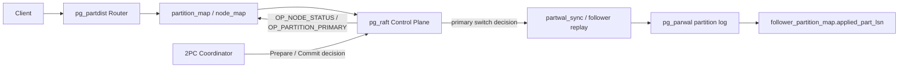

# ShardPG+ Raft 模块修订计划

## 1. 计划定位

本计划用于替代旧的“pgraft spike + 控制面 MVP”路线，作为后续 `/home/pxr/pg-citus-cluster` 项目修改的对照文档。

当前主线不再恢复 pgElephant/pgraft Go bridge，而是继续推进项目内已有的纯 C `pg_raft`。`pg_partdist` 已同步到师兄 `CyanPandas/ShardPG` 的 `shardpg-2.0` 进度，后续 Raft 只做控制面共识、切主决议和与新版 PartWAL 进度/回放机制的对接，不另起一套重复的数据面复制框架。

核心要求：主从切换不能只更新 `partition_map`。新的 primary 必须经由 Raft 多数派选举或多数派决议产生，并且必须拥有切换点之前的全部已提交分区日志或等价的 PartWAL 回放进度证明。

## 2. 当前项目状态

已具备：

- `pg_raft` 已支持 3 节点配置，`raft_enabled=on` 可直接启用。
- 当前控制面已具备 RequestVote、随机 election timeout、心跳、AppendEntries、`raft_log`、`raft_snapshot`、TopologyMonitor 和 failover 演示。
- `pg_partdist` 已同步到 `shardpg-2.0`，具备 `node_map` / `partition_map`、写路由、PartWALHeader、`partwal_sync` 同步写入路径、Demux crash-recovery/flush 辅助能力和 `pg_parwal/N` 分区日志目录。
- 新版 `pg_partdist` 已引入 `follower_partition_map(partition_id, local_relname, applied_part_lsn)`，作为 follower 回放进度的元数据基础。
- 新版设计文档 `pg-partdist-src/docs/FOLLOWER_REPLAY_DESIGN.md` 明确 follower 侧倾向复用 PostgreSQL redo 机制回放 per-shard PartWAL 物理日志流。
- `README-RAFT.md`、`setup-raft.sh`、`run-tests.sh`、`docs/interfaces/partwalmgr_raft.idl` 是后续保留并更新的主线文件。

当前缺口：

- RequestVote 已开始携带 `last_log_index` / `last_log_term` 并做日志新旧检查，但还需要多节点故障场景回归验证。
- HardState（`current_term`、`voted_for`、`commit_index`）已有本地文件持久化路径，已修正持 spinlock 写 hardstate 的不安全路径；还需要补充崩溃恢复和“先持久化，再响应”的专门回归测试。
- `raft_snapshot` 目前更像元数据快照，还不是完整的 Raft InstallSnapshot 机制。
- `OP_PARTITION_PRIMARY` 已开始携带 `old_primary_node`、`switch_partition_lsn`、`switch_orig_lsn`，并已接入最小 follower `applied_part_lsn` 候选过滤；后续还需要把该进度与真实 follower replay / ACK 链路打通。
- 新版 PartWAL 已有同步写入路径和 follower 回放进度表雏形，但 Raft 尚未接入 `applied_part_lsn` / ACK / 切主通知。
- 2PC 的 prepare / commit 决议尚未通过控制面 Raft 复制并等待 quorum ACK。

## 3. 目标架构



分层原则：

- 控制面 Raft：负责节点状态、分区 primary 变更、2PC 决议等元数据/决议日志。
- 数据面 PartWAL：以 `shardpg-2.0` 的 `PartWALInsert/PartWALFlush`、`pg_parwal` 和 follower replay 设计为基础，不在 `pg_raft` 内重复实现数据复制框架。
- 切主安全线：`OP_PARTITION_PRIMARY` 必须携带切换点 LSN，只允许 `applied_part_lsn` 或等价 ACK 进度追平的副本成为新 primary。
- 长期方向：每个 partition replica set 独立为一个 Raft group，partition primary 等同于该分区 Raft leader。

## 4. 阶段目标

### 阶段 0：归档旧路线并清理文档

目标：把 pgraft Go bridge 从当前实施路径中移除，仅保留为历史调研资料。

工作项：

- 清理旧 pgraft spike 文档、脚本和容器挂载入口，不再保留为当前仓库的运行入口。
- 从主文档中删除或弱化 `pgraft_is_leader()`、`pgraft_kv_put/get`、Go runtime、`shared_preload_libraries='pgraft'` 作为实施步骤的描述。
- 保留并更新 `README-RAFT.md`、`setup-raft.sh`、`run-tests.sh`、`docs/interfaces/partwalmgr_raft.idl`。
- 不删除 PostgreSQL 数据目录、构建产物和 `pg-cluster-data` 运行状态文件，除非后续单独执行工作区清理。

验收标准：

- README 明确写明当前主线是纯 C `pg_raft`。
- 旧 pgraft 资料不再作为仓库入口；需要历史记录时从 Git 历史查看。
- 过时 demo、组会展示、raft10 或备份脚本不再作为推荐入口。

### 阶段 1：补齐纯 C Raft 安全语义

目标：将当前 `raft_consensus.c` 从 demo 级共识推进到“最小安全 Raft 子集”。

工作项：

- 扩展 RequestVote RPC：`term, candidate_id, last_log_index, last_log_term`。
- 加入投票前的日志新旧检查，只有日志至少一样新的候选人才授票。
- 持久化 HardState：`current_term`、`voted_for`、`commit_index` 必须先落盘，再响应 RequestVote 或 AppendEntries。
- 完善 follower catch-up：落后 follower 恢复后通过 `nextIndex/matchIndex` 追赶。
- 增加 snapshot install 设计：日志落后超过可追赶范围时安装 `raft_snapshot`。
- 完善 leader 宕机重选：新 leader 必须拥有所有已提交日志，旧 leader 恢复后必须降级为 follower。
- 替换固定 ring buffer 的长期假设，补上日志截断/压缩策略。

验收标准：

- 多数派不可用时 propose 不提交。
- 日志落后的节点无法赢得选举。
- 旧 leader 恢复后不会覆盖新 leader 已提交状态。
- follower 掉线恢复后能通过日志或快照追平。

### 阶段 2：控制面 failover 正确性与新版 PartWAL 进度对接

目标：把分区 primary 切换从“改元数据”升级为“Raft 决议 + 新版 PartWAL 进度证明 + 切主通知”。

扩展 `OP_PARTITION_PRIMARY` payload：

```json
{
  "partition_id": 9102,
  "old_primary_node": 3,
  "primary_node": 1,
  "secondary_nodes": [2],
  "switch_partition_lsn": 123,
  "switch_orig_lsn": "0/16B6A20",
  "term": 8
}
```

切主流程：

1. TopologyMonitor 检测到 primary 故障后，生成一次 failover 提议。
2. 当前 leader 从新版 PartWAL 进度接口读取候选副本的 `applied_part_lsn` 或等价 ACK 进度。
3. 只有已经追平到 `switch_partition_lsn` 的副本才允许成为新的 primary；若没有进度来源，则拒绝自动提升并记录告警。
4. leader 提交 `OP_PARTITION_PRIMARY`。
5. apply 阶段更新 `partition_map`，并刷新 `pg_partdist` 缓存。
6. apply 完成后调用新版切主通知接口；若上游尚未提供，则保留并实现 `partwal_notify_primary_switch(partition_id, old_primary, new_primary, switch_orig_lsn)` 作为 Raft 与 PartWAL 的边界。
7. follower replay / `follower_partition_map` 随新 primary 完成角色和进度刷新。

验收标准：

- 只切换受故障 primary 影响的分区。
- 未追平 `switch_partition_lsn` 的 secondary 永远不能被提升。
- 切主前后 `partition_lsn` 保持单调。
- 旧 primary 恢复后只能以 secondary 身份回归。

### 阶段 3：接入 shardpg-2.0 数据面同步与 2PC 决议

目标：基于 `shardpg-2.0` 已有 PartWAL 同步写入和 follower replay 设计，实现方案文档要求的真正多副本同步，而不是在 Raft 模块里重新设计一套数据面。

PartWAL 接入链路：

- Primary 写入本地 `pg_wal`，`wal_insert_hook` 通过 `PartWALInsert` 捕获分区相关 WAL 记录。
- `XACT_EVENT_PRE_COMMIT` / `XACT_EVENT_PRE_PREPARE` 调用 `PartWALFlush`，保证 `pg_parwal` fsync 早于事务提交 WAL fsync。
- follower 侧按 `FOLLOWER_REPLAY_DESIGN.md` 方向回放 `pg_parwal` 物理日志，推进 `follower_partition_map.applied_part_lsn`。
- Raft 控制面读取 follower 进度，作为切主候选筛选和 quorum ACK 的依据。

事务语义：

- Prepare 阶段必须确认该分区 PartWAL 已写入并复制/回放到配置的副本 quorum。
- Commit WAL 和协调者最终决议必须在控制面 Raft 复制到多数派、数据面达到配置 quorum 后才能成功返回。
- 控制面 Raft 新增 `OP_PREPARE_DECISION` 和 `OP_COMMIT_DECISION`。
- 接口继续与 `GlobalXID`、TSO、增强 CLOG 保持对齐。

验收标准：

- prepare / commit 未达到 quorum ACK 前，客户端不能收到成功。
- primary 故障后，新 primary 能恢复 prepared / committed 决议。
- 跨分区事务不会出现部分提交。

### 阶段 4：长期演进为每分区独立 Raft group

目标：将每个 partition replica set 演进为独立 Raft group。

设计方向：

- 每个 partition 独占一个 Raft group，成员为该分区的 primary + secondaries。
- partition primary 就是该 partition 的 Raft leader。
- 数据日志可以直接作为 Raft log entry，或以 Raft 有序方式绑定 PartWAL record 提交。
- 控制面 Raft 继续负责拓扑、成员变更和故障感知，数据面 Raft 负责该分区日志提交。

验收标准：

- 单个分区的 leader 切换不影响其他分区。
- 写入只在该分区多数派提交后成功。
- 成员变更通过 joint consensus 或等价安全机制完成。

## 5. 接口规划

### Raft RPC

- `RequestVote(term, candidate_id, last_log_index, last_log_term)`
- `AppendEntries(term, leader_id, prev_log_index, prev_log_term, leader_commit, entries[])`
- `InstallSnapshot(term, leader_id, last_included_index, last_included_term, snapshot)`

### 控制面日志操作

- `OP_NODE_STATUS`
- `OP_PARTITION_PRIMARY`
- `OP_PREPARE_DECISION`
- `OP_COMMIT_DECISION`
- 后续可扩展：`OP_CONFIG_CHANGE`

### PartWAL 对接接口

```c
void partwal_notify_primary_switch(
    Oid        partition_id,
    int        old_primary_node,
    int        new_primary_node,
    XLogRecPtr switch_orig_lsn
);
```

该接口在 `OP_PARTITION_PRIMARY` apply 成功后调用。若 `shardpg-2.0` 后续提供正式切主接口，应优先改为调用正式接口；当前保留该接口作为 Raft 与 PartWAL 角色切换的边界。

Raft 还需要读取或补齐以下进度接口：

- 本节点某分区最新已持久化 `partition_lsn`。
- follower 某分区的 `applied_part_lsn`。
- 某分区副本 quorum 是否已达到指定 `switch_partition_lsn`。

## 6. 测试计划

现有基线：

- `test/sql/raft_01_leader_election.sql`
- `test/sql/raft_02_failover_partition.sql`
- `test/sql/raft_03_split_brain_guard.sql`
- `test/sql/raft_04_topology_monitor.sql`
- `run-tests.sh`

新增场景：

- leader 宕机后重新选举，并保证只有一个 leader。
- 日志落后节点竞选失败。
- 少于多数派时拒绝提交。
- follower 掉线恢复后通过日志或快照追平。
- 旧 leader 恢复后不能覆盖新 leader 的 `partition_map`。
- 切主前后 `partition_lsn` 保持单调，`applied_part_lsn` 未追平副本不得晋升。
- prepare / commit 在 quorum ACK 前不能向客户端返回成功。
- `pg_partdist` 新版同步写入路径：`PartWALFlush` 后 `pg_parwal` 记录存在且 `verify_partition_wal` 通过。

## 7. 文件清理策略

保留并更新：

- `pg-citus-cluster/README-RAFT.md`
- `pg-citus-cluster/setup-raft.sh`
- `pg-citus-cluster/docs/interfaces/partwalmgr_raft.idl`

归档或删除候选：

- 旧 pgraft spike 文档和脚本。
- 不再作为入口的 failover demo、组会 demo、raft10 demo 或备份脚本。
- 仍在描述“只做协调节点本地 apply”的旧 MVP 说明。

明确不清理：

- `pg-cluster-data/`
- `pg-install/`
- `.so` / `.o` 等构建产物，除非明确要求工作区整理
- 本地 PostgreSQL 运行时状态文件

## 8. 风险与对策

| 风险 | 对策 |
|------|------|
| 纯 C Raft 仍有 demo 级实现痕迹 | 先补齐最小安全 Raft 子集，再扩大数据面 |
| 只改 `partition_map` 会提升陈旧副本 | failover 必须绑定 `switch_partition_lsn` / `switch_orig_lsn` |
| PartWAL 复制链路与 `shardpg-2.0` 进度接口尚未完全打通 | 优先复用 `partwal_sync`、`follower_partition_map.applied_part_lsn` 和 follower replay 设计 |
| 2PC 决议丢失会导致部分提交 | 通过控制面 Raft 复制 prepare / commit 决议并等待 quorum |
| 每分区 Raft group 实现成本高 | 短期采用控制面 Raft + PartWAL quorum，长期再演进 |

## 9. 近期任务清单

### 已完成

1. 编译同步后的 `pg_partdist`，修正 `PG_CONFIG` 路径和新版依赖问题。
2. 审查并修正 `pg_raft` 与新版 `pg_partdist` 的编译/链接兼容性。
3. 为 Raft 增加读取本地 `switch_partition_lsn` 和 follower `applied_part_lsn` 的最小接口。
4. 在 `pg_raft_failover_partitions_for_node()` 中加入“未追平副本不能晋升”的候选过滤。
5. 在 `OP_PARTITION_PRIMARY` apply 后接入 `partwal_notify_primary_switch` 边界函数。
6. 修复 `raft_04_topology_monitor.sql` 触发的 leader backend 崩溃：
   - hardstate 持久化不再发生在 PostgreSQL spinlock 内。
   - `OP_PARTITION_PRIMARY` apply 不再在同一 SPI 连接里嵌套执行更新。
   - 跨 `SPI_finish()` 使用的分区、secondary、LSN 字符串已复制到调用者内存上下文，避免分区号变成 0 或 old_primary 读到垃圾值。
7. 已完成最小回归：`raft_01_leader_election.sql`、`raft_02_failover_partition.sql`、`raft_03_split_brain_guard.sql`、`raft_04_topology_monitor.sql` 均通过。
8. 已补齐“少于多数派不能提交”的控制面语义：
   - `pg_raft_consensus_propose()` 在未拿到多数派时会回滚本地未提交尾日志，不再让未提交提议残留并在之后被偷偷提交。
   - `raft_05_no_majority_reject_commit.sql` 已验证无多数派时 propose 失败，且 `node_map` 不会出现脏 apply。
9. 已补齐“日志落后候选者不能赢得投票”的回归：
   - `raft_06_stale_requestvote_rejected.sql` 已验证带陈旧 `last_log_index/last_log_term` 的 RequestVote 被拒绝。
   - 同时清理测试中注入的临时 `node_id=98`，避免后台 TopologyMonitor 对幽灵节点持续探测。
10. 已补齐“未追平 PartWAL 副本不能晋升”的回归：
   - `raft_07_uncaught_up_secondary_not_promoted.sql` 先写出真实 `switch_partition_lsn`，再验证 `applied_part_lsn` 未追平的 secondary 不会被自动提升。
   - `run-tests.sh` 已增加对应场景，并在 Raft 段结束后清理临时节点 `77/98/99` 与测试分区，避免和后续 DDL 回归互相干扰。
11. 已补齐“leader 宕机后重新选举、旧 leader 恢复后降级”为自动回归：
   - `raft_08_old_leader_rejoins_as_follower.sql` 已验证旧 leader 重启后只能以 follower 身份回归，且本地 propose 会被 `only leader` 拒绝。
   - `run-tests.sh` 已增加自动停旧 leader、等待新 leader、恢复旧 leader 的编排，并补充入口自恢复：缺失的 PostgreSQL 节点会自动拉起；缺失的 `pg_raft` 扩展或未收敛的 leader 会自动执行 `setup-raft.sh` 恢复。
12. 当前全量验收通过：
   - `bash /home/pxr/pg-citus-cluster/run-tests.sh`
   - 汇总结果为 71 通过、0 失败。

### 下一步

（第 1、5 项已于 2026-07-12、第 3 项部分与第 4 项已于 2026-07-15 在 shardpg-3.0 完成，见第 10 节）

1. ~~增加 HardState 崩溃恢复回归~~ 已完成：`raft_09_hardstate_crash_recovery.sql`。
2. 推进 follower replay / ACK 与 `applied_part_lsn` 的真实联动，而不是只读取当前占位进度。
3. 让 `OP_PARTITION_PRIMARY` 的 `switch_partition_lsn / switch_orig_lsn` 与真实分区写入路径、切主通知逻辑进一步收敛。
   - ~~切换点取数源与候选选择策略~~ 已完成（2026-07-15）：切换点优先远程读旧 primary 的
     `get_partition_flush_lsn`（真实写路径下 parwal 在承载分片的节点上），不可达回退
     leader 本地；候选人改为在追平者中选 `applied_part_lsn` 最大者；无进度源记 WARNING。
     回归：`raft_10_most_caught_up_secondary_promoted.sql`（并验证决议 payload 的
     switch_partition_lsn 等于真实 flush 进度）。
   - 剩余：切主通知从日志占位升级为真实角色切换——依赖第 2 项 follower replay 落地。
4. ~~“旧 leader 恢复后自动 catch-up 到新 leader 最新 committed log”的更强回归~~
   已完成（2026-07-15）：`raft_11_old_leader_log_catchup.sql`，预热/基线经 psql `-v` 变量
   + `set_config` 传入，无 shell 引号依赖；验证旧 leader 停机期间新 leader 提交的多条
   决议在其回归后被复制并 apply（`max(log_index)` 追平 + `node_map` 终态一致），且保持 follower。
5. ~~整理节点启停输出噪声~~ 已完成：`run-raft-tests.sh` 的 node_start 前置 pg_isready 探测。

## 10. shardpg-3.0 集成状态与审查差距(2026-07-12)

### 集成状态

pg_raft 已从 raft2.0 分支同步进 `CyanPandas/ShardPG` 的 `shardpg-3.0` 分支(`pg-raft-src/`),
并完成四节点适配(master:5432 + worker1-3:5433-5435,多数派 3/4;本文档前文所述
"3 节点"拓扑与 `/home/pxr/pg-citus-cluster` 路径均为历史环境,以 shardpg-3.0 的
raft4 四节点环境为准):

- 三个 PartWAL 边界函数(`get_partition_flush_lsn` / `get_follower_applied_part_lsn` /
  `partwal_notify_primary_switch`)已在 `pg-partdist-src/src/raft_boundary.c` 正式落地,
  不再依赖独立 adapter 拷贝。
- `pg_raft_format_conninfo()` 支持 worker3:5435 与 master 别名,并改为优先使用
  `node_map` 中的端口。
- `setup-raft.sh` / `run-raft-tests.sh` / raft_02 / raft_04 / raft_07 已按四节点改写。
- 四节点回归基线:raft_01–raft_08 全部通过(23 项断言);数据面无负载回归 10/10 通过。
- 近期任务清单"下一步"第 1 项已完成:`raft_09_hardstate_crash_recovery.sql` 验证
  follower immediate 崩溃重启后 term 不回退、已提交日志不丢、不自立为 leader、
  复制链路恢复可追平新决议;harness 同时校验 `pg_raft_hardstate` 文件在盘。
  第 5 项(启停 FATAL 噪声)已通过 node_start 前置 pg_isready 探测解决。
- 2026-07-15 增量:"下一步"第 3 项的切换点取数/候选选择部分与第 4 项完成——
  failover 切换点优先远程读旧 primary 的真实 flush 进度(不可达回退 leader 本地,
  无进度源记 WARNING);候选人在追平者中选 `applied_part_lsn` 最大者。新增回归
  `raft_10_most_caught_up_secondary_promoted.sql`(最追平副本被提升 + 决议 payload
  的 switch_partition_lsn 等于真实写入路径 flush 进度)与
  `raft_11_old_leader_log_catchup.sql`(旧 leader 停机期间的已提交决议在回归后
  追平并 apply)。四节点回归基线更新为 raft_01–raft_11 共 27 项断言全过。
  同时:根目录 RAFT2_HANDOFF.md / raft_module_revision_plan.md /
  pg_partdist_sync_change_log.md 移入 `docs/`;
  `docs/INTEGRATION-citus-shard-parwal.md` 按 shardpg-3.0 现状重写。

### 审查差距(留待后续,按优先级)

1. **主从切换目前只到元数据层**:shardpg-3.0 的 follower 物理回放仍是设计稿
   (`pg-partdist-src/docs/FOLLOWER_REPLAY_DESIGN.md`),`follower_partition_map`
   有表无写入方,跨节点分区日志传输(WalSender/Receiver)不存在。因此
   `OP_PARTITION_PRIMARY` 决议能正确切 `partition_map.primary_node` 并满足
   切主安全线,但数据不会真正流向新 primary;`partwal_notify_primary_switch`
   仍为日志占位。对应本计划阶段 2 → 3 的过渡,依赖数据面 follower replay 落地。

2. **方案文档与 3.0 实现的差异,以代码为准**:方案文档描述的是
   "Demux Worker 流式解复用 + WalSender DATA/SKIP + PartWALReceiver/PartWALApply"
   流水线;3.0 实际是 parwal-2.0 同步写路径(`wal_insert_hook` 捕获 +
   PRE_COMMIT 同步落盘 `pg_parwal/<oid>/`,Demux 退化为一次性崩溃恢复,
   无流复制、无 SKIP 记录)。Raft 依赖的抓手(`partition_lsn` 单调序号、
   段文件、`GetLastWrittenPartitionLSN`)在两种路径下语义一致,不影响控制面;
   但阶段 3 的"日志分发/接收"设计需按同步写路径重新对齐,SKIP 机制仅在
   恢复流式分发时才需要。

3. **partition_id 的全局身份问题**:3.0 的 `pg_parwal/<partition_id>` 目录名
   使用分片表在本节点的 OID,而 OID 是每节点独立分配的;副本机制落地后,
   同一逻辑分片在不同节点上 OID 不同,Raft 元数据(`partition_map.partition_id`)
   需要一个全局一致的分片标识与各节点本地 OID 的映射
   (`follower_partition_map.local_relname` 已为此预留)。切主决议与进度比对
   必须基于全局标识,否则跨节点 `applied_part_lsn` 比较无意义。
